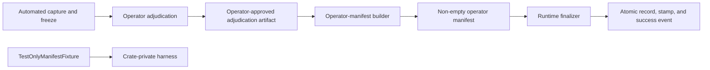
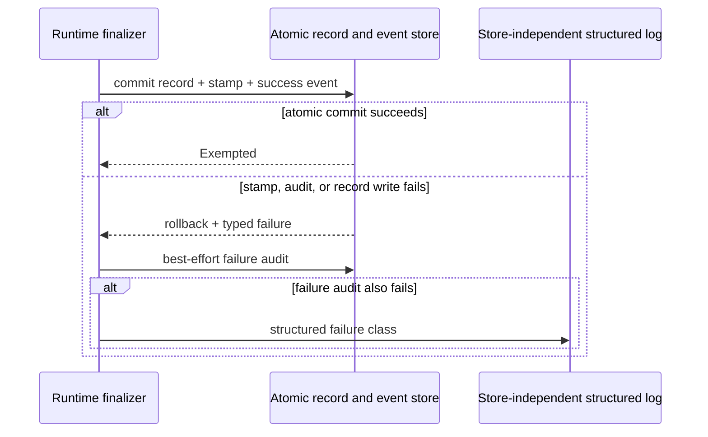

# ADR-115: Exact-Content Manifest Exemption for the Write Secret Gate

**Status**: Accepted
**Date**: 2026-07-16
**Authors**: khive maintainers
**Relates to**: [ADR-018](ADR-018-authorization-gate.md) (authorization Gate seam, rejected as
the layer for this decision, with its Gate-error posture amended by ADR-129),
[ADR-014](ADR-014-curation-operations.md) (curation operations, unaffected),
[ADR-015](ADR-015-schema-migrations.md) (migration policy, if a durable event shape requires one),
[ADR-096](ADR-096-warm-daemon-per-request-identity.md) (single-principal host-trust posture this ADR
relies on and does not extend)

---

## Context

### The false-positive class

The secret gate (`crates/khive-runtime/src/secret_gate.rs`) is a content-only heuristic scanner
invoked at roughly twenty post-authorization call sites: every KG create/curation path, knowledge
CRUD, KG propose, comm, brain, and GTD writes take the hard-block `check()` / `check_json()` /
`check_tags()` path; git ingest and session mirror take the redact-not-block `mask_secrets()`
path. It runs after authorization, on content only — it receives no caller identity, path, or
provenance signal, only the literal string being written.

Two issues document a false-positive class that this heuristic layer cannot resolve on its own:

- **#1040**: legitimate long repository-path citations (for example
  `docs/adr/C-ADR-007-authorization-server.md:70`) trigger `high-entropy-token` detection because
  the path contains a trigger substring (`auth`) and the whole path's Shannon entropy lands just
  over the detector's 4.5 threshold — measured at 4.50–4.66 on the five real false positives in
  this issue. A document that cites such paths repeatedly cannot be stored at all; masking the
  string destroys the citation, which is the content the write is trying to preserve.
- **#1056**: 68 of 653 records (10.4%) in a production batch ingest of code-review markdown were
  rejected. The trigger is the legitimate case itself: prose about authentication and token
  handling naturally contains high-entropy strings and trigger words together.

### Why a content-shape fix is structurally exhausted

The maximum Shannon entropy of an N-character run is `log2(N)`. A per-run entropy cap that fixes
the five #1040 false positives and three related leaks reopens twelve adversarial regressions,
because `log2(16) = 4.0` — any run of sixteen or fewer characters has zero discriminating power
under that cap, so a real secret split across short separator-delimited runs passes undetected.
An experimental branch (`fix-1040-perrun-entropy`) holds these twelve deliberately red tests as
the record of this dead end. Relaxing the `near_trigger` guard on the existing structured-identifier
exemption is similarly unsound: random tokens of twenty-four or fewer characters pass the
structured-identifier shape check. Content shape alone cannot separate "prose about a token" from
"a token."

### The frozen corpus

A workspace ingest script builds `create()` calls over the daemon; the secret gate rejects some of
them, and the script catches each rejection and appends it to a blocked list. That blocked list
currently holds 548 records — the corpus this ADR's acceptance suite is built against. A
cloud-side false-positive corpus also exists and is treated as secondary evidence, re-run after
local acceptance, not as a substitute for it.

### The trust landscape

No provenance reaches the gate today; `check()` and friends take content only. Every
caller-presentable provenance signal that could in principle scope an exemption is forgeable on
this host's single-principal warm daemon:

- `namespace` is client self-reported and forgeable same-uid.
- `actor_id` is process-fixed from config; it does not identify the connection
  (see [ADR-096](ADR-096-warm-daemon-per-request-identity.md), which independently establishes
  that even the Gate checks a fixed process-level actor, not the connecting peer).
- `properties.source_path`, stamped by the untrusted ingest script, is never validated.
- `properties.content_sha256_16`, a caller-supplied hash assertion, is forgeable as passed — it
  becomes trustworthy only if the runtime itself recomputes the digest and checks it against a
  manifest whose write path is separately controlled. No such recomputation exists today.

`.khive/workspaces/**`, the directory the frozen corpus originates from, is not an
OS-enforced boundary: it is an ordinary same-uid-writable directory with no hook or permission
gate. Per [ADR-096](ADR-096-warm-daemon-per-request-identity.md), this host's safety already rests
on the socket being owner-only and the database being directly reachable by that same uid, not on
gate-side discrimination between callers. Any exemption scoped by path, actor, namespace, or verb
would therefore convert "write a file to a writable directory" into "bypass the secret gate" —
this is the threat model this ADR must not lose sight of (see Threat Model, below).

The [ADR-018](ADR-018-authorization-gate.md) Gate seam runs at dispatch, before the handler, over
`GateRequest { actor, namespace, verb, args }` and `GateContext.source`. It has no content span
and no verified hash. The shipping gate is `AllowAllGate`, so there is no live policy
discrimination at that seam today.

Since content shape is exhausted and provenance is unenforceable except through a
runtime-recomputed content hash, the only sound remaining axis is exact content: does the runtime
itself recognize the literal bytes being written as a specific, previously adjudicated record.

---

## Decision

Adopt a **runtime-owned, exact-content SHA-256 manifest exemption inside `secret_gate`**, under
explicit single-principal host trust, at per-record granularity, with a runtime-applied reserved
posture property and annotate-by-default consumer views. This is a precision mechanism for a
human-adjudicated false-positive corpus. It is not provenance authentication and not a security
boundary against the trusted uid.

### 1. Layer: inside `secret_gate`, not the Gate seam

The exemption decision executes inside `crates/khive-runtime/src/secret_gate.rs`, the only layer
that sees the exact value being scanned. `check()`, `check_json()`, and `check_tags()` gain an
internal exemption lookup that runs before the heuristic detectors are enforced: on a manifest hit,
the call returns a typed exemption outcome instead of the detector's block/pass result; on a miss
of any kind, control falls straight through to the unchanged heuristic path.

The [ADR-018](ADR-018-authorization-gate.md) Gate seam was considered and rejected for this
decision (see Alternatives). No new pre-handler attestation service and no dedicated bypass verb
are introduced.

### 2. Trust model: explicit host trust, with recomputation as a precision instrument only

The ADR states plainly, per [ADR-096](ADR-096-warm-daemon-per-request-identity.md)'s posture, that
on the supported personal-local deployment same uid is trusted, and that the secret gate's real job
is hygiene against accidental credential persistence through khive's normal write surface — not
defense against a same-uid adversary. The exemption does not change that.

The runtime recomputes a full domain-separated SHA-256 digest over the exact value presented to the
scanner and matches it against a preloaded, versioned in-memory manifest. This recomputation
prevents caller-assertion forgery and exact-byte drift; it identifies the submitted bytes as equal
to a specific, previously reviewed manifest entry. It does **not** authenticate the connection, the
caller, or the manifest's own provenance beyond the same-uid host-trust boundary that already governs
every other khive write path.

The digest input is:

```text
SHA256("khive-secret-gate-v1\0" || runtime_field_scope || "\0" || exact_value_passed_to_scanner)
```

`runtime_field_scope` is a closed, runtime-owned enum — not caller-supplied text — distinguishing at
minimum: record content, name/description, JSON properties, tags, and code source. An exemption
computed for one field scope never applies to another; a value that is byte-identical between two
scopes still requires two independent manifest entries. The frozen 548-record corpus uses the record
content scope. For the JSON-properties scope specifically, the current scanner examines keys and
values as independent strings (`scan_json_value` applies no key-conditioned value heuristics), so a
per-string manifest entry is exactly as granular as the detector it overrides; any future detector
that becomes key-aware — scoring a value differently because of the key it sits under — breaks that
equivalence and must revisit this exemption's per-string lookup in the same change.

Caller-supplied `properties.content_sha256_16`, `source_path`, `namespace`, `actor`, and `verb` play
no role in eligibility. Only the runtime-recomputed full digest and runtime-assigned field scope
determine a match.

### 3. Granularity: exact per-record allowlist

Eligibility is C1: one manifest entry per exact gated content value in the frozen 548-record corpus.
It does not depend on path, namespace, actor, source, or verb. Any future false-positive batch
requires its own reviewed manifest revision; there is no path-class, actor-class, or verb-class
exemption.

The manifest is **operator-curated and fixed before ingestion**:

- An operator reviews the exact corpus and produces an independent adjudication record stating the
  corpus contains no real credential. Automated scanner output alone does not establish this.
- The manifest is generated from that adjudicated list by a shared canonical builder that calls the
  same digest routine the runtime uses at request time. It is never generated by scanning
  `.khive/workspaces/**` or any other directory at load time, at startup, or on a retry.
- **Canonicalization parity is mandatory, not incidental.** The digest must be computed over the
  exact in-memory string `secret_gate` receives at scan time — after whatever JSON unescaping,
  Unicode normalization, and newline canonicalization the request path already applies before
  calling `check()` / `check_json()` / `check_tags()` — never over raw bytes read from a file on
  disk. If the offline manifest builder hashes raw file content while the runtime scans a
  post-parsing, framework-normalized string, the two digests silently diverge and the entire corpus
  fails to match. The builder must therefore drive its input through the same parsing/normalization
  code path the live write path uses (not merely the same hash function), or the acceptance suite's
  548-of-548 bar is unreachable by construction. The acceptance suite includes a canonicalization
  parity check as a precondition, run before the 548-record positive path: pick a representative
  subset of the corpus containing non-ASCII content, embedded newlines, and JSON-escaped characters,
  and assert the builder-computed digest equals the digest the live scan path computes for
  byte-identical source input.
- No watcher, startup scan, recursive directory command, or ingest retry may add manifest entries
  automatically. Auto-enrollment of any directory, including `.khive/workspaces/**`, is forbidden.

A missing, malformed, stale, unreadable, or unknown-version manifest, or any digest or field-scope
mismatch, falls through to the current non-exempted scanner path. The exemption never widens
admission; it can only narrow what the existing heuristic would otherwise have blocked.

### 4. Marking: runtime-applied, reserved posture property

On a manifest match, the runtime applies:

```text
properties["khive:secret_gate"] = "exempted:content-sha256-manifest-v1"
```

as part of the same write that persists the record. The caller cannot request, set, or supply this
value; it originates only from the typed internal exemption outcome the gate returns.

> **Amendment 1 supersession:** The full-inventory requirements in the remainder of this subsection
> remain the target architecture, but they are superseded as acceptance conditions for the initial
> slice by [Amendment 1 §3](#3-initial-implementation-scope-and-follow-on-obligations). The original
> requirements remain visible here as the specification for the named follow-on work.

Every write path that accepts or carries `properties` **must reject** a caller attempt to create,
set, replace, merge, or remove `khive:secret_gate`, whether or not the record is actually exempted.
The sole tolerated caller-side appearance of the key is the byte-exact echo of the currently
persisted value defined in the update rule below, which is stripped before any diff or merge —
never accepted as an input. This reservation applies across the full write inventory, not only the
public `create` verb:

- KG create, update, atomic-prepare, curation, merge, and delete/restoration paths that copy
  properties;
- KG proposal creation, review/apply, and any proposal-materialization path;
- knowledge CRUD and section edits;
- comm primary send and direct heartbeat handling;
- brain and GTD writes;
- `code.ingest`, including its direct-write path (this path has no dispatch equivalent to the other
  create paths and the gate must run directly on it);
- git ingest and session mirror paths, even though their existing secret behavior is masking rather
  than blocking;
- every future write path that accepts or carries record properties.

An implementation that enforces this reservation only on the workspace ingest script or only on the
public `create` verb does not satisfy this decision.

**Mechanism, not a threaded capability token.** The reservation above is enforced at a single
shared write-finalization boundary — which this decision **requires the implementation to
introduce**, not one it assumes exists. Today the listed write paths invoke the gate at separate
sites: the curation update path composes and merges patches itself, the create family checks in the
runtime operations layer, and `code.ingest`'s direct-write path runs its own preflight. The
implementation must refactor these into (or route them through) one shared finalization step
through which every runtime, pack, and direct-write path persists properties, with `code.ingest`
reaching the same reservation logic and the same atomic stamp-plus-audit write rather than a
parallel copy. The typed `Exempted` outcome is consumed exactly once, at that finalization step,
immediately after `secret_gate` returns it; it is not threaded as a capability object through the
~20 intermediate call sites. The full-inventory acceptance test verifies this concrete boundary,
not the call graph's current shape. Any implementation that instead grows a bespoke
unforgeable-token parameter through every handler signature is solving a different, more invasive
problem than this decision requires.

**Updates to an already-exempted record must not blindly preserve the stamp.** A caller performing
an ordinary read-modify-write — fetching a record, changing an unrelated field, writing the whole
payload back — must not be blocked merely because the fetched payload still carries
`khive:secret_gate` from the prior read. Caller intent is not observable at the write boundary, so
the reservation is defined as an observable wire rule over the payload bytes, never an intent rule:

- **Echo normalization.** Before any property diff or merge, the runtime strips from the incoming
  payload a `khive:secret_gate` entry whose value is byte-identical to the value currently
  persisted on the target record. Such an echo has no effect on the outcome; the stored value is
  determined solely by the runtime rule below. This is the only caller-side appearance of the key
  that is tolerated.
- **Everything else is rejected.** Supplying the key where the target record has none persisted,
  supplying any value that differs from the currently persisted one, or explicitly removing a
  persisted one (where the write shape expresses removal as an operation rather than omission) must
  fail. Write shapes that replace the full property set rather than patch it distinguish the
  tolerated echo from every forbidden variant by the same byte comparison against the persisted
  value.
- **The runtime alone decides the stored value.** After echo normalization: if the write does not
  modify the bytes on the exempted field/scope, the runtime carries the existing stamp and audit
  linkage forward unchanged, without re-running the exemption lookup. If the write **does** modify
  those bytes, the runtime treats the new bytes as an entirely new scanner input: it re-runs the
  manifest lookup against the new content, and the prior stamp is **not** carried forward. A miss
  on the new content falls through to the ordinary heuristic path exactly as it would for a
  never-exempted record. An implementation that preserves the stamp across a content-changing
  update — allowing an attacker to swap an exempted record's content for an evasive, unreviewed
  payload while the record still reads as exempted — does not satisfy this decision; the acceptance
  suite's failure-and-laundering path (below) tests this directly.

**Exemption scope is content-and-field-scope, not record-scoped, and this is deliberate.** A manifest
entry exempts a specific byte sequence at a specific field scope wherever that exact sequence recurs,
not a specific record. This follows directly from Decision §3: eligibility does not depend on which
record the content lands in. The exemption stamp is a scanner-bypass signal for adjudicated
false-positive content and nothing more. It confers no elevated trust, validation status, or
activation authority on any structural, administrative, or security-sensitive field a downstream
consumer application may define over the same field scope (for example, a JSON key a consumer treats
as a control flag). Downstream consumers **must not** infer that an exempted value is safe to
interpret as authorization, configuration, or executable instruction merely because it carries this
stamp — the stamp means only "matched a reviewed non-secret," never "vetted for this field's
semantics." This constraint is binding on any future ADR or implementation that builds
interpretation logic over `properties`.

Every successful exemption produces one queryable audit event carrying: mechanism, full digest,
field scope, manifest id, canonical verb, actor, namespace, the detector result that was overridden,
final outcome, and the persisted record id. It records no content and no detector excerpt. The event
records also distinguish `exempted`, `manifest-invalid`, `audit-failed`, `stamp-failed`, and
`record-write-failed` outcomes. This audit is part of the exemption control itself, not a general
[ADR-018](ADR-018-authorization-gate.md) Gate audit event, and its failure semantics are independent
of the Gate audit and infrastructure-error handling defined there and amended by ADR-129 (see
Fail-closed, below). An admitted exempted record must never exist without both its reserved stamp and
a queryable audit event; if the
implementation cannot make this atomic in one transaction, it must use a transactional outbox or
equivalent, and audit-persistence failure on this path blocks the write rather than proceeding.

> **Amendment 1 supersession:** The paragraph above remains normative for successful admissions,
> including atomic record, stamp, and success-event durability. Its requirement that all failure
> distinctions be durable through the event store is superseded by
> [Amendment 1 §4](#4-failure-observability-and-load-bearing-atomicity), which makes those
> distinctions typed runtime outcomes and requires a store-independent signal when best-effort
> failure-audit emission fails.

### 5. View behavior: annotate by default

The posture property is durable record data, not a filtering directive. Recall, search, `context`,
and export preserve and expose `khive:secret_gate` on every projection that already exposes
properties. None of these consumers hide or down-rank an exempted record by default under this ADR.
Consumers may build an explicit filter or ranking adjustment over the property; that is a separate
view-layer decision requiring its own evidence, per the data-vs-view principle this codebase already
follows (`docs/adr/../CLAUDE.md` — data records history and marks state, the query/view layer decides
what is shown).

### 6. Fail-closed, unconditionally

> **Amendment 1 clarification:** `stale` no longer denotes manifest age. The concrete,
> fail-closed version and corpus-identity faults, and the acceptance construction for each, are
> defined by [Amendment 1 §5](#5-concrete-manifest-version-and-freshness-semantics).

The exemption is a scoped carve-out from the existing heuristic path, not a replacement for it. Any
error condition on the exemption path — missing, unreadable, malformed, stale, duplicate-conflicting,
unsupported-algorithm, or unknown-version manifest; stamp-write failure; audit-persistence failure —
degrades to the current, unchanged blocking behavior. It never degrades to allow. ADR-129 now also
makes [ADR-018](ADR-018-authorization-gate.md) Gate-infrastructure errors fail closed, but that
policy governs the coarse authorization seam, not this content-level exemption. The two layers
refuse independently for different reasons.

---

## Threat Model

### Concrete staging attack

1. An agent, possibly compromised or prompt-injected, writes a file containing a real credential
   into `.khive/workspaces/**`.
2. The file is not in the fixed manifest, so its recomputed full-content digest misses.
3. The unchanged secret scanner evaluates the content and blocks the write.
4. If an attacker instead modifies a byte of an already-allowed record, the digest changes before
   detector evaluation and the exemption does not apply to the modified content; it is evaluated by
   the ordinary scanner path like any other non-matching content.

This attack succeeds only if some process automatically adds staging-directory hashes to the
manifest, or if the attacker can modify the manifest or the database directly. This ADR forbids the
former (§3) and does not claim to defend against the latter.

### The human break in the chain

- **Required, enforced step**: an operator reviews the exact corpus and produces a versioned,
  human-adjudicated manifest before ingestion. Only preloaded exact entries can ever match; nothing
  in the runtime enrolls a new entry from a write verb, path pattern, actor, namespace, or flag.
- **Conventional, not enforced, step**: on the personal-local host, the same-uid host-trust posture
  from [ADR-096](ADR-096-warm-daemon-per-request-identity.md) governs who may replace the manifest
  file itself. Without an external signer or a separate OS principal, manifest administration is a
  convention, not an adversarial boundary. This ADR states that explicitly rather than implying
  otherwise.

### Same-uid adversary

A same-uid process capable of modifying the manifest file or the underlying database can already
bypass the daemon entirely by writing `~/.khive/khive.db` directly, exactly as
[ADR-096](ADR-096-warm-daemon-per-request-identity.md) already establishes for every other khive
write path. This exemption grants such a process no new capability. It is explicitly out of scope
for this ADR to defend against that adversary.

### Shared or hosted, multi-principal profile

This exemption is **not approved for shared or hosted multi-principal service** under this ADR and
must remain disabled there. [ADR-096](ADR-096-warm-daemon-per-request-identity.md) already blocks
such service pending a connection-identity mechanism that does not exist today. Enabling this
exemption on a shared or hosted profile would additionally require a manifest authority outside
tenant and agent reach — normally a control-plane signer or a separate OS principal — which is a
separate ADR and deployment decision, not a consequence of anything decided here.

---

## Security claims this ADR makes

Provided the acceptance suite below passes:

1. Eligibility is based on a runtime-recomputed, domain-separated full SHA-256 digest of the exact
   scanner input and a runtime-assigned field scope.
2. Caller-supplied path, namespace, actor, source, verb, stamp, and `content_sha256_16` do not
   establish eligibility.
3. Only the 548 manifest entries, byte-for-byte and scope-for-scope, receive the exemption in the
   frozen acceptance run.
4. Non-matching content follows the unchanged secret scanner and remains fail-closed.
5. Missing, malformed, stale, unreadable, unsupported, or mismatched manifest state cannot broaden
   admission.
6. A staging-path write alone cannot gain eligibility, because enrollment is not automatic.
7. Every admitted exempted record is durably marked and has a queryable exemption event.
8. The hot path performs one content hash and an O(1)-ish in-memory lookup, with no per-write
   manifest file I/O or signature verification.
9. On the personal-local profile, the change improves precision for adjudicated false positives
   while preserving existing hygiene behavior for every other runtime write.

## Security claims this ADR must disclaim

1. This is not a defense against a malicious or compromised same-uid process.
2. This is not connection authentication, caller authentication, tenant isolation, or Gate
   authorization.
3. A hash match proves byte equality with a manifest entry, not that the bytes are safe or
   secret-free.
4. The local manifest is not cryptographic provenance or a signed attestation unless an independent
   signer and verification policy are actually deployed, which this ADR does not build.
5. `source_path`, namespace, actor, verb, and caller-supplied hashes remain forgeable and are not
   trusted by this mechanism.
6. This design does not protect direct database writes, operator-mode writes, manifest replacement
   by the trusted uid, or any path outside the runtime gate.
7. The posture property proves only that khive's normal runtime recorded an exemption outcome. It
   cannot make a directly modified database trustworthy.
8. Passing the frozen corpus and its mutation suite is evidence for those specific test inputs, not
   proof that no unknown credential format can ever pass.
9. This design is not approved for shared or hosted multi-principal use.
10. The fixed manifest does not solve future false-positive classes automatically; each new class
    requires its own adjudicated manifest revision.

This ADR and its implementation must not describe the mechanism as "trusted provenance", "secure
attestation", "governed workspace path", or "prevents secret leakage" without immediately narrowing
the claim to the boundaries above.

---

## Acceptance: the frozen 548-file corpus

> **Amendment 1 sequencing:** This section is the second rung of the acceptance ladder and is a
> mandatory precondition for shipping any non-empty operator manifest. The first, behavior-neutral
> implementation slice is accepted under [Amendment 1 §1](#1-acceptance-ladder).

### Frozen inputs and adjudication

1. Check in, or otherwise immutably identify, the existing 548-entry blocked list and a corpus
   manifest containing path label, full raw-file SHA-256, runtime scanner-input SHA-256, runtime
   field scope, and the expected legacy detector reason.
2. Record one corpus-level manifest digest, so a changed, added, or removed file fails the test
   before the exemption is exercised.
3. An independent human adjudication record states that the 548 exact inputs contain no real
   credential. Automated scanner output alone cannot establish this condition.
4. Generate the runtime exemption manifest from the adjudicated list only. Never generate it by
   scanning the workspace directory during the acceptance run.

### Baseline and positive path

1. With the exemption disabled, reproduce the frozen baseline and account for all 548 records; any
   drift is explained before testing the exemption.
2. With the exact manifest enabled, ingest through the real workspace script, daemon transport,
   normal `create` operation, the shared handler, the secret gate, storage, and the readback path.
3. The acceptance bar is **548 of 548 persisted**, not "near 100 percent." A miss indicates
   canonicalization, field-scope, coverage, or corpus drift and must be investigated, not waived.
4. For every record, assert byte-for-byte content equality after readback, the exact reserved stamp
   value, exactly one matching persistent exemption event, the correct manifest id, and no
   caller-supplied posture field.
5. Assert the ingest script's blocked-record list is empty for this corpus, and that no unrelated
   error is hidden under the success metric.

### Staging-attack and true-positive negative path

1. For each of the 548 inputs, create a mutated copy containing at least one detector-valid
   synthetic credential fixture, changing the digest while preserving the surrounding
   false-positive content. All 548 mutated writes must be rejected and none persisted.
2. Test representative synthetic credential shapes for every current detector family, outside the
   corpus. No fixture may be a live credential.
3. Change one non-secret byte in each allowed input and assert it no longer receives an exemption.
   Its eventual scanner outcome may pass or block on its own merits, but no stamp or exemption event
   with outcome `exempted` may appear for it.
4. Submit the exact allowed content under a different runtime field scope and assert no exemption.
5. Submit an allowed record whose tags or JSON properties contain a synthetic credential; the
   allowed content field may still match, but the record must be rejected by the separately scanned
   field.

### Failure and laundering path

> **Amendment 1 clarification:** In item 1, `stale-version` is constructed through the four
> concrete cases in [Amendment 1 §5](#5-concrete-manifest-version-and-freshness-semantics), not by
> elapsed age.

1. Exercise absent, unreadable, malformed, duplicate-conflicting, stale-version, unsupported-
   algorithm, truncated-digest, and refresh-failure manifests. Each case must preserve the current
   blocking behavior for the false-positive corpus.
2. Attempt every forbidden `khive:secret_gate` variant through every write family listed in
   Decision §4, including proposal apply and `code.ingest`: supply the key where none is persisted,
   supply a value differing from the persisted one, and explicitly remove a persisted one. Every
   such attempt must fail. Then submit a full-payload write echoing the exact persisted value with
   only an unrelated field changed, and assert it succeeds with the echo stripped — the stored
   stamp afterwards reflects only the runtime's own carry-forward/re-lookup rule, with no new
   exemption event.
3. Force stamp-persistence failure and exemption-audit-persistence failure. No exempted record may
   remain stored in either case.
4. Verify that source class, actor, namespace, verb, and caller-supplied hashes never change
   eligibility.
5. **Update-laundering path.** For each of a representative subset of the 548 exempted records,
   issue an update that changes an unrelated field and assert the stamp and audit linkage carry
   forward unchanged with no new exemption event. Then issue an update that replaces the exempted
   field's content with a mutated, detector-valid synthetic credential (reusing the Staging-attack
   fixtures) and assert: the prior stamp is not carried forward, the new content is evaluated fresh
   against the manifest (and misses), and the write is rejected by the unchanged heuristic path. A
   build that preserves the stamp across a content-changing update fails this test.

### Canonicalization parity precondition

Before running the positive path, assert the offline manifest builder's digest equals the live
scan-path digest for a representative subset of the corpus covering non-ASCII content, embedded
newlines, and JSON-escaped characters, using byte-identical source input to both. A mismatch here
invalidates the entire acceptance run and must be fixed before proceeding, not worked around by
patching individual manifest entries.

### Consumer and performance path

1. Read every admitted record through `get`, `search`, `memory.recall` where applicable, `context`,
   and session or general export paths. The posture annotation must survive every projection that
   already exposes properties.
2. Verify an explicit filter can exclude exempted records without deleting or mutating them, and
   that the default view neither filters nor down-ranks them.
3. Instrument manifest loading and lookup: after startup or an explicit refresh, file-open and
   signature-verification counts on the write hot path must remain zero.
4. Benchmark the gate with the 548-entry manifest and a larger projected manifest; report p50 and
   p95 overhead and confirm the cost is linear in content size plus approximately constant-time
   lookup. Do not claim a numeric performance bound that has not been measured.
5. Re-run the cloud false-positive corpus after local acceptance passes, as additional evidence, not
   as a replacement for the frozen 548 test.

---

## Relationship to other ADRs

- **[ADR-096](ADR-096-warm-daemon-per-request-identity.md)**: this ADR's entire trust claim rests on
  ADR-096's already-accepted single-principal host-trust posture. It extends nothing beyond that
  posture; it does not build connection identity, and it explicitly keeps the exemption disabled on
  any profile ADR-096 has not cleared for multi-principal service.
- **[ADR-018](ADR-018-authorization-gate.md)**: the Gate seam was considered and rejected as the
  layer for this decision (see Alternatives). The Gate's `GateRequest` carries no content span and
  no verified hash; making it content-aware would require threading the exact scanner input and a
  runtime field scope into the request, a recomputation/consumption step in every handler, and
  equivalent treatment of the `code.ingest` direct-write path — which reconstructs this ADR's design
  after an added policy round trip. ADR-129 has since made Gate infrastructure errors fail closed,
  but the Gate still lacks the content evidence this exemption requires. A future real Gate may
  still authorize who is permitted to administer the exemption manifest; it must not decide whether
  submitted bytes match an entry.
- **[ADR-014](ADR-014-curation-operations.md)**: curation operations (`update`, `delete`, `merge`)
  are unaffected by this ADR beyond the property-reservation requirement in Decision §4 — none of
  them may set or clear `khive:secret_gate` on the caller's behalf, and `merge` must carry the
  property forward only from the runtime's own record state, never from a caller-supplied patch.
- **[ADR-015](ADR-015-schema-migrations.md)**: if implementation requires a durable event shape or
  an index that the existing event/notes schema cannot express, it must land as a new
  `VersionedMigration` (the next available version at implementation time) with its DDL in its own
  `sql/NNN-*.sql` file. V1 is never edited. The reserved `properties` key itself needs no schema
  change, since `properties` is already a JSON-valued column on every record kind that carries it.

---

## Alternatives Considered

### Exemption layer

- **At the [ADR-018](ADR-018-authorization-gate.md) Gate seam.** Rejected. The seam is coarse —
  verb, namespace, actor, source — and has no content access. Making it content-aware converges on
  this ADR's own design plumbed through an extra policy round trip. ADR-129 has removed the former
  fail-open-on-error difference, but it does not give the Gate content-specific evidence. The
  shipping Gate is `AllowAllGate`, so this option is also inert today.
- **A new pre-handler attestation service.** Rejected for now. A dedicated component that
  recomputes hashes and consults the allowlist ahead of dispatch offers cleaner separation, but it
  is a new registry, lifecycle, cache, refresh protocol, and failure surface with no distinct trust
  source to justify it. If it is embedded in the runtime with access to the exact content, it
  collapses into a helper inside `secret_gate` anyway; if it is external, it introduces availability
  and fail-open pressure this ADR explicitly rejects. Reconsider only if a future deployment
  introduces multiple attestation mechanisms or an external control-plane signer.
- **A dedicated bypass verb** (an ingest-only create variant). Rejected. The capability becomes
  addressable by any same-uid caller able to name the verb, it forks create semantics, and it
  repeats the direct-write coverage hazard already present in `code.ingest`'s existing path.

### Trust model

- **Real attestation as the security claim** (signed manifest, independent signer, verified at the
  runtime). Rejected as the claim this ADR makes. Under the current same-uid model, a key or
  manifest writable by that uid is not independent of the process it is meant to constrain; a truly
  external key, separate OS principal, hardware-backed signer, or hosted control plane is new
  operational infrastructure this ADR does not build. The recomputation mechanism itself is
  retained, but only as an exact-selection instrument over a fixed manifest, never sold as a
  security control.

### Exemption granularity

- **Per-source-class** (for example, all of `.khive/workspaces/**`). Rejected. That directory is an
  ordinary same-uid-writable path with no OS-level or hook-level control; a source-class exemption
  is exactly the surface the staging attack in Threat Model targets.
- **Per-actor.** Rejected. Actor identity is process-fixed and does not identify the connection; any
  same-uid process can present the same attribution context.
- **Per-verb, or per-verb plus flag.** Rejected. This is an addressable bypass capability equivalent
  in exposure to a dedicated bypass verb, and it institutionalizes a second create path per source.

---

## Implementation fences

### MAY

- Add a versioned runtime manifest type and load or explicitly refresh it into an immutable
  in-memory hash set.
- Extend the secret-gate result type to carry an internal exemption outcome and the metadata
  required for stamping and audit.
- Use a shared offline or admin manifest builder that calls the same canonical digest routine the
  runtime uses.
- Add an additive migration if durable event shape or indexing genuinely requires it, as a new
  `VersionedMigration`; never edit V1.
- Add explicit view filters over the reserved posture property.

### MAY NOT

- Accept a caller-provided bypass mode, exemption flag, stamp, digest assertion, path class, actor,
  namespace, source, or verb as sufficient eligibility.
- Auto-enroll any directory, including `.khive/workspaces/**`.
- Skip scanning any other field on a record because one field matched the manifest.
- Introduce a new entity kind, note kind, or edge relation.
- Place the decision behind an unenforced [ADR-018](ADR-018-authorization-gate.md) obligation, or
  depend on `AllowAllGate` policy behavior for correctness.
- Add a dedicated bypass create verb.
- Perform manifest file I/O or signature verification on every write.
- Fail open on manifest, stamp, or exemption-audit errors.
- Describe the local hash manifest as secure provenance or as protection against a same-uid
  adversary.
- Enable the exemption for shared or hosted multi-principal service under this ADR.

### Verify by

> **Amendment 1 sequencing:** These checks remain the non-empty-manifest acceptance rung. They do
> not prevent the behavior-neutral initial slice described in Amendment 1 §1 from landing with an
> absent or empty deployed manifest.

- 548 of 548 exact records persist through the end-to-end acceptance path.
- 548 of 548 credential-mutated records are rejected, with zero persisted records among them.
- Zero caller-originated reserved-property mutations succeed across the full write inventory in
  Decision §4.
- Every admitted exempted record has the exact stamp and exactly one queryable audit event.
- Every non-match and every manifest failure follows the unchanged scanner path.
- No hot-path manifest file I/O occurs after load or an explicit refresh.
- Search, recall, `context`, and export preserve the annotation without hiding it by default.
- The cloud false-positive corpus re-run introduces no true-positive leak.

---

## Consequences

**Positive**

- Resolves the #1040 and #1056 false-positive class for the frozen 548-record corpus without
  weakening the heuristic scanner's behavior on any other content, and without any content-shape
  change that reopened adversarial regressions in the abandoned per-run entropy approach.
- Keeps the trust claim honest and narrow: an exact, human-adjudicated, runtime-verified match
  instead of a coarse, forgeable provenance signal.
- Establishes a durable, queryable posture property and audit trail that downstream consumers can
  build explicit policy on, without khive silently reclassifying records at the storage layer.

**Negative / risks**

- Recurring operational cost: every new false-positive batch needs its own human adjudication and
  manifest revision. This is the accepted cost of keeping the exemption exact rather than
  path-, actor-, or verb-scoped.
- The trust boundary is host-trust, not a new security control. A reader of this ADR who expects
  "provenance-scoped" to mean "cryptographically authenticated" will be wrong; the Security claims
  section exists specifically to prevent that misreading.
- Central property reservation (Decision §4) must cover the full write inventory or a forgotten path
  becomes a silent laundering surface; the acceptance suite's failure-and-laundering path is the
  regression backstop for this, not a one-time audit.

---

## Open questions

1. **SPEC-GATE**: confirm this ADR preserves the exact claim boundary in Security claims, and that
   548-of-548, the reserved-property invariant, the staging mutation suite, and the one-record-one-
   event audit invariant are normative acceptance criteria, not implementation-time negotiable
   targets.
2. **Only if strategy changes**: whether khive must defend against a compromised same-uid agent, or
   enable this exemption on a shared or hosted profile, is out of scope here. Either choice requires
   an external signer or separate OS principal, key custody and revocation, connection identity, and
   control-plane authorization — a separate ADR. This ADR's default is to defer that investment and
   make no such claim.
3. **Only if the one-record-one-event invariant is judged too expensive**: whether exemption audit
   may be best-effort rather than transactionally coupled to the write. This ADR's position is no;
   weakening it changes the accepted threat and explainability posture and should not be a local
   implementation trade.

> **Amendment 1 resolution:** Open question 3 is superseded. Successful admission remains
> transactionally coupled to its stamp and success event; failure-audit emission follows Amendment
> 1 §4.

---

## Amendment 1 (2026-08-19): Executable initial scope and activation gates

**Status**: Accepted

This amendment resolves implementation sequencing and failure semantics that were not executable
as written. It is normative and last-in-time where it conflicts with the base text. The
exact-content eligibility rule, host-trust boundary, unchanged scanner fallback, reserved posture
value, and prohibition on automatic enrollment remain unchanged.

### 1. Acceptance ladder

Acceptance has two explicit rungs.

1. **Initial behavior-neutral implementation slice.** The deployed operator manifest is absent or
   empty, so no ordinary runtime write can become newly eligible and externally observable behavior
   remains unchanged. An in-process, crate-private harness is sufficient for this rung. It must
   exercise the manifest types and digest parity, one-snapshot lookup, runtime-owned finalization,
   reserved-key enforcement, typed outcomes, atomic successful admission, rollback faults, the
   deterministic failure constructions of §4 including the second-order failure of the best-effort
   failure audit, and the legacy knowledge-admission behavior. It may use only the test-only fixture defined in §2 to
   exercise a non-empty lookup. Passing this rung accepts the implementation mechanism; it does not
   authorize a non-empty operator manifest.
2. **Non-empty operator-manifest activation.** Before any release, configuration, or artifact may
   ship a non-empty operator manifest, the existing frozen-corpus acceptance section must pass
   through the real workspace script, daemon transport, normal `create` operation, shared handler,
   secret gate, storage, and readback path. The bar remains 548 of 548 persisted with byte-exact
   readback, the reserved stamp, exactly one successful exemption event per fresh admission, an
   empty blocked-record list, and all existing negative and laundering checks. A crate-private
   harness, a synthetic fixture, or a statement that the path will be tested later cannot satisfy
   this rung.

The second rung is a mandatory activation precondition, not optional release evidence. A failure at
either rung fails closed and does not permit a partial manifest.

### 2. Builder input and test-only fixture separation

The operator-manifest builder **must consume an explicit, versioned adjudication artifact** whose
entries are the operator-approved list. It must bind that artifact to the frozen corpus identity and
must reject a missing artifact, an unapproved entry, an identity mismatch, or an incomplete mapping
between approved entries and emitted manifest entries. Automated capture or freeze output may
supply candidate bytes and reproducibility evidence, but it is never valid builder input on its own
and never proves adjudication.

A separate fixture named **`TestOnlyManifestFixture`** is permitted solely for the crate-private
acceptance harness. Both of the following properties are normative:

1. It is non-deployable by construction wherever the build system can enforce that boundary. It
   must carry a distinct test schema marker or use a test-only load path that the production loader
   refuses outside test builds; a production operator-manifest builder must not accept it.
2. Its definition site must state: **“This fixture is not evidence of operator adjudication.”** A
   passing fixture test cannot be cited as satisfying the adjudication prerequisite or the second
   acceptance rung.



### 3. Initial implementation scope and follow-on obligations

The initial slice's admission-capable set is exactly the following, each routed through the shared
runtime finalizer, with the durable stamp written into the final stored `properties` object and the
atomic success event keyed to the target's identity:

- entity create, update, and bulk mutations, including direct code-ingest entity candidates;
- note create, update, and atomic-message mutations, including direct code-ingest note candidates.

The admission-capable set is defined by code path, not by verb: a mutation is admission-capable if
and only if it reaches storage through the shared finalizer's entity or note constructor entry
points named above. Merge and restore participate exactly when their implementations construct a
final entity or note candidate through those entry points; a merge or restore implementation that
writes rows by any other path is reservation-only and owned by #2057. In the initial slice,
curation, atomic-prepare, and proposal-materialization implementations must not route through the
finalizer's entry points: they remain reservation-only on their legacy write paths, and #2057 owns
their migration. That is an implementation obligation, not a competing classification — the
code-path criterion stays the sole test of admission capability.

The finalizer and its constructor entry points are introduced by this slice's implementation, and
one runtime-owned module must declare the complete entry-point list. The first acceptance rung's
matrix is generated from that declaration, and #2057's inventory is every property-bearing write
path that does not pass through a declared entry point. A write path added later either routes
through a declared entry point or extends #2057's inventory; the declaration is the auditable
anchor for both.

Everything else is reservation-only in this slice: knowledge atoms and domains, proposal-only
metadata, edge metadata, merge reasons, embedding-content overrides, and any field not present in
the final stored entity or note use the unchanged blocking scanner and can never receive a stamp.
Deletes preserve or remove existing rows without fresh exemption. The legacy knowledge-admission
path retains its existing scanner behavior, rejects the reserved property wherever it accepts or
carries properties, and cannot consume an exemption in this slice. This is a scope reduction for
sequencing, not a deletion of the base ADR's target architecture. This enumeration and the first
obligation below are the same list read in two directions: #2057 owns every property-bearing path
not named admission-capable here.

The following exclusions are named obligations. Each issue reference must be replaced with a real
tracked issue before this amendment merges:

- **Complete full write-inventory finalization.** Route every property-bearing runtime, pack,
  proposal-materialization, curation, merge, restore, and direct-write path named in Decision §4
  that is not in this section's admission-capable enumeration through the shared finalization and
  reservation contract. **Owner reference:** `(follow-on issue: #2057)`.
- **Extend knowledge admission beyond the legacy path.** Define the durable stamp, target identity,
  atomic event representation, and readback contract before a knowledge record can consume an
  exemption. **Owner reference:** `(follow-on issue: #2058)`.
- **Integrate the git redaction surface.** Define whether it remains permanently mask-only or gains
  a final stored target with the same stamp and atomic success-event guarantees; no exemption is
  allowed until then. **Owner reference:** `(follow-on issue: #2059)`. **Resolved by Amendment 2.**
- **Integrate the session redaction surface.** Define whether it remains permanently mask-only or
  gains a final stored target with the same stamp and atomic success-event guarantees; no exemption
  is allowed until then. **Owner reference:** `(follow-on issue: #2060)`. **Resolved by Amendment 2.**
- **Integrate the MCP redaction surface.** Preserve current masking until a final stored target,
  stamp location, and atomic success-event boundary are specified and implemented; no exemption is
  allowed until then. **Owner reference:** `(follow-on issue: #2061)`. **Resolved by Amendment 2.**

The five obligations are disjoint: #2058 through #2061 own exactly their named surfaces, and #2057
owns every other excluded property-bearing path. Closing #2057 neither closes nor is blocked by the
four named-surface obligations.

An excluded surface follows its unchanged blocking or masking behavior. It cannot consume a
manifest match, synthesize the reserved stamp, or claim coverage under either acceptance rung.
Narrowing the implementation without its named obligation is non-conforming.

The reserved-key reservation is not deferred. During the initial slice, every properties-bearing
write path — admission-capable or excluded — must reject caller creation, replacement, merge, or
removal of the reserved property, exactly as Decision §4 of the base text requires. The named
obligations defer finalization routing, durable stamps, and exemption consumption for the excluded
paths; they do not defer, narrow, or supersede the reservation rule on any path.

### 4. Failure observability and load-bearing atomicity

The five required distinctions are typed runtime outcomes:

- `Exempted`
- `ManifestInvalid`
- `AuditFailed`
- `StampFailed`
- `RecordWriteFailed`

`Exempted` is the only successful admission outcome. A successful fresh admission must durably
commit the record, reserved stamp, and one queryable success event in one atomic unit. If that
atomic unit cannot commit all three, it commits none.

Failure-audit emission is best-effort because a diagnostic cannot be required to persist through
the event-store channel whose failure it reports. A failed stamp, audit, or record write returns its
typed failure outcome after rollback and may attempt a failure audit. If that best-effort emission
fails, the same code path **must emit a structured log line through a store-independent channel**.
That log line must name the typed failure class and must not include submitted content or a detector
excerpt. The independent log is evidence of an audit gap, not a substitute for a durable success
event and not evidence that a record was admitted.

These requirements are testable by construction. The implementation must expose an injectable
failure seam for each of `ManifestInvalid`, `AuditFailed`, `StampFailed`, and `RecordWriteFailed`,
and an injectable store-independent log sink. The first acceptance rung must include a deterministic
construction for each typed failure, plus the second-order case in which the best-effort failure
audit itself fails: the harness captures the structured log record through the injected sink and
asserts that it names the typed failure class, that it contains no submitted content and no detector
excerpt, and that no record, stamp, or success event survives the rollback, before the typed failure
outcome is returned to the caller.

The following invariant is load-bearing and unchanged: **no admitted record may survive a stamp,
audit, or record-write failure.** Implementations must not weaken rollback in order to make failure
diagnostics durable.



### 5. Concrete manifest version and freshness semantics

“Stale manifest” no longer means elapsed age. This ADR defines no time-to-live, age threshold, or
wall-clock expiry for a manifest. The former `stale-version` acceptance label maps to four concrete,
testable faults, each of which publishes or retains an empty effective manifest and follows the
unchanged scanner path:

1. **Unknown schema version.** Construct an otherwise well-formed document whose schema version is
   not supported. Loading must return the typed version fault, leave no active entries, and reject a
   corpus input that would have matched under a supported version.
2. **Missing expected corpus identity.** Load a non-empty, otherwise valid document while the
   runtime's own configuration has no expected corpus identity. Loading must return the typed
   missing-identity fault, leave no active entries, and preserve the legacy rejection.
3. **Corpus-identity mismatch.** Pin identity A in the runtime's own configuration and load an
   otherwise valid document declaring identity B. Loading must return the typed mismatch fault,
   leave no active entries, and preserve the legacy rejection. Caller-supplied request fields can
   neither provide nor override the expected identity.
4. **Refresh failure.** Begin with a valid snapshot, then refresh from an unreadable, malformed,
   unknown-version, missing-identity, or identity-mismatched document. The refresh must make the
   effective snapshot empty before returning its typed fault; a subsequent would-have-matched input
   must follow the legacy scanner and receive no stamp or successful exemption event.

Each fault above is a distinguishable cause of the `ManifestInvalid` outcome defined in §4: loading
and refresh return `ManifestInvalid` carrying the specific fault, and each acceptance construction
asserts the specific fault rather than the bare outcome.

For v1, the expected corpus identity is the corpus-level digest required by the frozen-inputs
acceptance section and is pinned by runtime-owned configuration. Every construction above is
fail-closed. Adding age, revision ordering, revocation, or manifest-id freshness requires a later
amendment with an explicit source of truth and acceptance fixture.

### Alternatives retained as rejected

- Treating the crate-private harness as evidence for non-empty deployment is rejected because it
  does not exercise the required transport and operator workflow.
- Treating automated capture or freeze output as approval is rejected because generation and
  adjudication are separate trust steps.
- Expanding every persistence and redaction surface in the initial slice is deferred through the
  named obligations above; inventing missing target and atomicity contracts locally is rejected.
- Requiring a failure event to persist only through the failing event store is rejected as
  non-executable; silently dropping a failed best-effort audit is also rejected.
- Interpreting staleness as age is rejected because no clock, threshold, or revocation authority is
  defined.

## Amendment 2 (2026-08-29): Permanent mask-only redaction surfaces

This amendment resolves the three redact-not-block surface obligations #2059, #2060, and #2061.
Git ingest, session mirroring, and MCP diagnostics remain **permanently mask-only**. None is an
admission-capable finalizer surface, none can consume a manifest match, and none can synthesize the
reserved `khive:secret_gate` property or an exemption-success event.

The executable declaration is `secret_gate::RedactionSurface` plus
`redaction_surface_contract`. Every named call site enters the canonical detector through
`mask_for_redaction_surface`; the returned value contains the ordinary redaction marker for every
detected span. The wrapper deliberately has no manifest, stamp, or event input or output. Adding an
admission mode or a fourth named surface requires an ADR amendment and an exhaustive contract-test
change, not an untyped boolean or caller option.

### 1. Git ingest (#2059)

- **Final stored target:** the normalized commit, issue, and pull-request entity/note fields built
  by git ingest. Detector-matching bytes are replaced before those candidates reach runtime writes.
  Remote URL userinfo/query redaction remains an additional, independent normalization step.
- **Stamp location:** none. Masked records never carry `khive:secret_gate` merely because masking
  occurred.
- **Atomic success event:** none. A normal git-ingest write can emit its existing domain/audit
  effects, but there is no exemption admission to attest.
- **Readback:** consumers receive the masked stored fields. The pre-mask text is not recoverable
  through the record and no posture annotation claims that it was allowlisted.

### 2. Session mirror (#2060)

- **Final stored target:** `session_messages.text` and `session_messages.raw`, plus the parsed title
  projections that share the same masker. Masking occurs while constructing the parsed event,
  before the mirror writes it.
- **Stamp location:** none. Session rows have no exemption posture property.
- **Atomic success event:** none. Mirror persistence remains idempotent under its existing cursor
  and row semantics; masking is a deterministic transformation, not an admitted exemption.
- **Readback:** only the masked text/raw projections are returned. The mirror never retains an
  alternate unmasked payload for later recovery.

### 3. MCP diagnostics (#2061)

- **Final stored target:** none. The named surface is a bounded caller-visible backend diagnostic
  in the response envelope, not a durable knowledge record.
- **Stamp location:** none.
- **Atomic success event:** none. Transport sanitization happens independently of operation result
  persistence and cannot assert exemption success.
- **Readback:** not applicable. The bounded diagnostic is masked before it is returned; truncation
  and omission metadata remain transport concerns and do not create a durable redaction record.

### 4. Security and acceptance invariants

1. A detector match on any named surface is replaced by the canonical redaction marker.
2. The masked output passes the ordinary blocking scanner; no detected credential survives.
3. Every named surface reports `PermanentMaskOnly`, a null stamp property, and a null atomic
   success event through the executable contract.
4. Git and session declare their actual durable targets; MCP declares no durable target.
5. Caller identity, verb, namespace, path, and request arguments cannot switch these modes.

These choices are conservative and one-way: permanently mask-only surfaces may lose false-positive
content, but they cannot become a laundering channel for manifest exemptions. A future need to
preserve exact bytes must introduce a separately reviewed final stored target with atomic
record/stamp/success-event semantics; it cannot reuse these masking wrappers.
