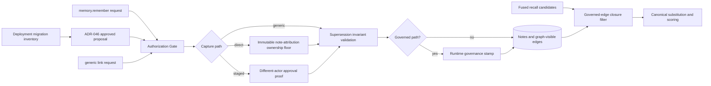
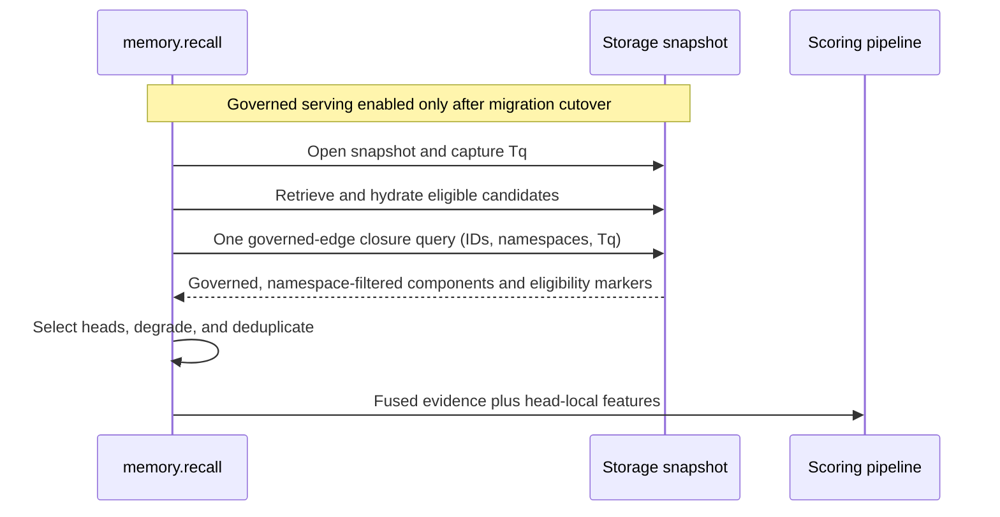

# ADR-157: Canonicalize Verified Supersession Chains Before Memory Recall Scoring

**Status**: proposed
**Date**: 2026-08-15
**Scope**: ownership-bounded `memory.remember` supersession capture, ADR-046 staged capture,
runtime-reserved note ownership and edge governance attribution, reviewed legacy migration,
offline edge backfill, and the internal `memory.recall` pipeline. The public recall wire shape
remains unchanged, and the generic graph edge contract is not narrowed.
**Supersedes (narrowly)**: ADR-013's default-retrieval rule that any incoming `supersedes` edge
makes a note non-current, only as that rule applies to `memory.recall` after the migration-gated
activation defined here. ADR-013 otherwise stands.

## Context

A production-derived labelled evaluation of `memory.recall` (42 real directive-recall
queries; 22 with a labelled correct answer in the store) measured nDCG@10 0.673, with the
correct answer in the top 10 for 20 of 22 answerable queries. Both complete misses shared
one failure mechanism: the stored correct answer was a correction note that intentionally
replaced an earlier note, the replacement was recorded only in note text rather than as a
`supersedes` edge, and the terse correction lost lexically to the older, vocabulary-richer
note it replaced. The remaining 20 of 42 queries had no stored answer at all — a
persistence gap outside retrieval's reach and explicitly out of scope here.

Today the recall pipeline applies supersession only as binary suppression after scoring.
It gathers all ranked candidate IDs into one `EdgeFilter`, pages that candidate-batched
filter to exhaustion, unions the matched target IDs with a `properties.supersedes`
shortcut, and removes those IDs. This is already a batched exclusion operation, not a
per-candidate graph access pattern. It cannot substitute a chain head that retrieval did
not rank or preserve a matched member's fused retrieval evidence for that head. A previous
attempt at additive temporal scoring was reverted because recency terms outweighed
semantic relevance on unrelated queries; any mechanism here must not reintroduce that
class.

That behavior implements [ADR-013](ADR-013-note-kind-taxonomy.md)
§“Supersession via edge, not field,” which says default retrieval excludes a note with any
incoming `supersedes` edge. The current implementation is directly visible in
`crates/khive-pack-memory/src/handlers/recall.rs`: the suppression stage pages all matching
incoming edges, unions their targets with `properties.supersedes` targets, and removes the
union. This ADR therefore changes serving semantics, not only future write semantics, and
requires an explicit compatibility transition.

## Teardown

- **Two misses are too few for a change.** They are too few for a general ranking policy,
  but they are 2/22 — 9.1% — of queries with a stored correct answer, and both share one
  failure mechanism. That supports a narrow correctness mechanism, not a ranking program.
- **Write-time edges plus binary filtering are sufficient.** No. Write-time capture is
  prospective; filtering can remove obsolete candidates but cannot guarantee that a weaker
  successor enters the served set.
- **An edge alone enables chain-head replacement.** No. The edge must be governed, a chain
  member must be present in the pre-final candidates, every traversed edge and node must
  remain in that candidate's namespace, and the chain must have one live memory head created
  no later than the query start.
- **Caller-editable note metadata proves direct ownership.** No. The predicate is sound only
  if creation derives the attribution from resolved runtime identity and every later write
  preserves it. A request-supplied or merge-transferred marker is not provenance.
- **Correction-like text is trustworthy structure.** No. Negation, quotations, malformed
  IDs, and scope differences can fabricate graph truth. Text may support a curation
  proposal, never automatic edge creation.
- **Cluster recency safely approximates supersession.** No. Similarity does not establish
  replacement, and it cannot recover targets absent from the served pools.
- **A reranker feature is the smallest change.** Under ADR-033, feature reranking is
  optional and replaces default scoring when configured. Verified truth must not depend on
  an optional weight.
- **Corpus check.** The prior-decision search was inconclusive at authoring time; the
  acceptance check must confirm no conflicting accepted ADR was missed.

## Decision

Treat supersession as verified truth canonicalization, not as a general ranking signal.
Only **GOVERNED** supersedes edges participate: the runtime must have stamped the edge's
reserved `metadata.created_by_actor` key from resolved identity on either the
ownership-bounded `memory.remember` direct path or the ADR-046 path after different-actor
approval. The direct ownership proof reads the target memory note's immutable,
runtime-reserved `properties.created_by_actor` value, stamped server-side from resolved
identity when that note was created. Canonicalization begins with an edge set filtered to
governed edges in the candidate's write namespace. Cross-namespace and ungoverned edges are
absent from closure input, exactly as if they did not exist. It then follows only live
(non-deleted) memory nodes, selects only a live memory head, and excludes every note or edge
created after the recall query's start snapshot. No classification, degradation, suppression,
or substitution may branch on an ungoverned edge.

Adopt immutable note ownership attribution, governed write-time capture, reviewed historical
migration and backfill, and one batched governed-edge chain-head substitution. Keep the current
recall behavior active until the migration set is processed and the serving predicate is cut
over. Do not adopt cluster recency or reranker features from this evidence.

### Component boundary

The Gate is the authorization seam and may apply stricter deployment policy. The
direct-path ownership check is the minimum prevention rule guaranteed by this ADR, not a
Gate policy. The write validator enforces data-integrity invariants, while the closure
query applies serving predicates without changing stored records.

A supersedes edge is **GOVERNED** only when `metadata.created_by_actor` was written
server-side from the path's resolved runtime identity after one of those two proofs. Merely
having the same source, target, relation, namespace, or apparent metadata value does not
grant governance.

### 1. Capture supersession atomically

`memory.remember` may gain an optional, bounded `supersedes: [<full-memory-uuid>, ...]`
field.

Edges are directed `new --supersedes--> old`. Every target must be a live (non-deleted)
memory note in the caller's resolved write namespace, which is also the new note's
namespace. On this direct path, every target must also carry durable
`properties.created_by_actor = {"kind": <kind>, "id": <id>}` exactly equal to the caller's
resolved actor identity. A target outside that namespace, a target attributed to another
actor, or a target without that property is refused as `invalid_supersedes`; namespace
visibility alone is not sufficient. The ownership predicate reads only this server-stamped
creation provenance on a note created under reserved-property enforcement; request content,
mutable note fields, and a same-named property on a pre-enforcement note are not evidence. The
refusal payload includes `staged_path: "ADR-046 proposal lifecycle"`. The write must not create
a cycle. The note and all declared edges commit atomically; failed validation or edge creation
commits neither.

Cross-actor and legacy-target supersession uses the existing ADR-046 proposal lifecycle.
A change-set proposing the `supersedes` edge lands only after approval by an actor other
than the proposer. That staged path supplies mandatory review; this ADR does not duplicate
or replace ADR-046's lifecycle mechanics. At apply time, that governed path stamps the edge's
`metadata.created_by_actor` server-side from the resolved apply identity. Legacy rows without
durable ownership properties are never backfilled with guessed ownership.

The write remains authorized at the existing ADR-018 Gate seam. Its `GateRequest` carries
the resolved caller actor, the resolved write namespace, and the unchanged target IDs in
the request arguments, so deployed policy can evaluate all three. After the Gate allows
dispatch, the handler enforces the ownership floor plus the same-namespace, liveness,
memory-kind, and cycle invariants. Gate policy may tighten access further, but it may not
relax this ADR-level floor. These checks do not create a new capability system and are not
storage authorization checks.

Every path capable of creating a `memory` note stamps durable
`properties.created_by_actor = {"kind": <kind>, "id": <id>}` from the resolved caller
identity, server-side, at creation. This includes `memory.remember`, generic `create`,
ADR-046 `AddNote` apply, and direct runtime create paths; no memory-note insert may bypass the
derivation. Each directly created governed edge carries the same attribution shape and the
write namespace, stamped server-side only after the ownership floor succeeds.

The deployment records a durable note-attribution enforcement boundary when these guarded
creation paths become active. A memory note created before that boundary is a legacy target and
must use ADR-046 even if its caller-controlled properties already contain a same-shaped
`created_by_actor` value. The rollout neither trusts nor rewrites such a value.

The field name and write surfaces are grounded in the current implementation. `Note` calls
its arbitrary metadata container `properties` (`crates/khive-types/src/note.rs`), while the
edge request surface calls its container `metadata`
(`crates/khive-pack-kg/src/handlers/params.rs::LinkParams`); edge `update` calls its patch
`properties`, and both map to stored edge metadata. Generic `CreateParams` and `UpdateParams`
accept note `properties`; ADR-046 `ProposalChangeset::AddNote` carries a `NoteDraft`; and
`merge(kind="note")` folds the two stored property objects through
`KhiveRuntime::merge_note_with_reason`. `memory.remember` currently constructs properties
internally and accepts no caller-supplied `properties`. There is no generic note `edit` verb;
`knowledge.edit` updates pack-private knowledge sections rather than note rows. Any future
note-edit surface must route through the same reserved-property guard before it can ship.

`properties.created_by_actor` is a **RUNTIME-RESERVED note property** for memory notes. A
caller-supplied value at generic create or ADR-046 note creation, or a patch that names the
key through `update` or any note-edit surface, including `null` or a removal request, is
rejected as `reserved_note_property_key`; it is never silently stripped. When a note write
omits the key, the existing value is preserved. A non-object or whole-container replacement
that could erase the key is likewise rejected. Only the creation path derives the initial
value, and no later generic write may set, change, or clear it.

Note merge is preservation-only for this property under every merge strategy. The surviving
`into` record carries its own original `properties.created_by_actor` value verbatim; it never
inherits the removed `from` record's value, and an unstamped survivor remains unstamped. The
removed record retains its original attribution in history. Merging notes with different
attributions does not transfer attribution or establish that either actor authored or owns
the other record's contributed content; authority over the other actor's original record
still requires the ADR-046 staged path. No merge request can supply a replacement attribution.
These note-side rules are reserved-property input validation and preservation, not a
tightening of ADR-002 or ADR-017's base endpoint contract.

`metadata.created_by_actor` is a **RUNTIME-RESERVED edge-metadata key**. Generic edge write
surfaces, including `link`, natural-key edge upsert, and edge `update`, must reject any
caller-supplied value for that key, including `null` or a removal request, as
`reserved_edge_metadata_key`; they must not silently strip it. The governed direct path and
ADR-046 apply path are the only writers and derive the value from resolved runtime identity
rather than request content. An edge update, re-link, or natural-key upsert that omits the
reserved key preserves any existing stamp while applying other metadata changes. No generic
write can set, change, or clear the stamp. This is metadata input validation, not
endpoint-contract tightening. [ADR-017](ADR-017-pack-standard.md)
§“Pack-extensible edge endpoints” makes endpoint rules additive only: packs cannot tighten
ADR-002's base contract and can only add legal pairs. Edge creation therefore continues
through the centralized endpoint validator, and a contract test must prove that the
composed ADR-002 base rules and loaded ADR-017 `EDGE_RULES` accept
memory-note-to-memory-note `supersedes`; no handler-local bypass is permitted. Because the
endpoint contract cannot be narrowed, recall authority is enforced by the reserved stamp
and the serving-side predicate instead.

A `supersedes` edge created through generic `link` remains legal graph data under that base
contract. It remains visible to graph queries and traversal and may preserve historical
meaning, but, because it lacks the runtime stamp, it has no recall-canonicalization
authority unless it was present in the pre-activation inventory and is admitted through the
different-actor-approved migration path. Recall substitution is a view-layer privilege granted
only to governed edges. The migration below reviews pre-existing recall authority without
inferring note authorship; a generic edge created after that inventory remains ungoverned.

The request field is an edge-creation instruction, not a second authority marker in note
properties. A governed supersedes edge can be removed through the existing by-ID curation
surface, `delete(id=<edge-uuid>)`, which remains subject to the existing Gate. The next
recall snapshot then excludes that edge and restores the prior eligible head. This is the
recovery path for an incorrect or malicious governed supersession; no separate unsupersede
verb is introduced. Deleting an ungoverned edge changes graph history but cannot change
recall canonicalization.

Correction-text detection may emit diagnostics or proposals. It may not mint edges or
affect ordering.

### 2. Backfill through curation

An offline campaign may scan historical notes for supersession claims. Each scan is
bounded to live (non-deleted) notes of kind `memory` in one captured namespace snapshot.
Both the proposed source and target must be live memory notes in that same namespace. The
campaign produces dry-run proposals containing the source note, resolved target, evidence
span, resolution method, and per-edge annotation.

Backfill reads and proposals use same-namespace evidence only. A legacy property reference
to a note in another namespace is reported as a diagnostic; it does not produce a proposal
or governed edge and, after activation, never participates in serving suppression. Before
activation, the compatibility rule in §3 leaves current recall behavior unchanged.

Full UUIDs may be proposed directly. Short IDs are eligible only when uniquely resolved
against the captured namespace snapshot. Ambiguous claims remain observations. Only
ADR-046 proposals approved by an actor other than the proposer create edges. Approved
writes traverse the same Gate and atomic data-integrity validation as explicit capture;
the direct-path target-ownership check does not apply because the different-actor approval
is the staged authorization for legacy or cross-actor targets. The proposal apply path
stamps each resulting edge's reserved `metadata.created_by_actor` server-side from its
resolved apply identity, so the backfilled edge is governed and eligible for recall
canonicalization. A dry-run result, unapproved proposal, or legacy property has no governed
edge authority. After activation, any edge without the runtime stamp — including a generic-link
edge not approved through the migration in §3 — remains ungoverned and absent from closure
input.

Complexity is `O(N × L + P)` offline, with no recall hot-path cost.

### 3. Migration and compatibility

#### Behavior delta

Before activation, the current `memory.recall` contract remains in force: every matching
incoming `supersedes` edge can suppress its target, regardless of governance metadata, and
the legacy `properties.supersedes` shortcut can do the same. After activation, only governed
edges can affect recall canonicalization; legacy properties and ungoverned edges are inert to
that serving decision.

This is the narrow supersession relation declared at the top of this ADR. It supersedes only
ADR-013 §“Supersession via edge, not field” lines 148-150's default-retrieval rule as applied
by `memory.recall`: the existence of an arbitrary incoming edge no longer proves that a memory
note is non-current. ADR-013's edge direction, history preservation, chain-walk model, graph
visibility, endpoint contract, and all behavior outside this `memory.recall` serving predicate
remain in force.

#### One-time reviewed migration

Before activation, deployment tooling captures a consistent inventory of every live
`supersedes` edge that exists in the deployment and every legacy `properties.supersedes`
reference currently eligible for recall suppression. Every edge appears in a reviewable
migration set; an edge that is cross-namespace, has ineligible endpoints, or otherwise cannot
be governed is recorded with that disposition rather than omitted. No existing edge silently
loses recall authority without appearing in this set.

Existing edges are backfilled to governed status through the same reviewed ADR-046 batch path
used above for legacy property references. Each proposal identifies the existing edge UUID and
natural key, its endpoint and namespace checks, and its current metadata. When the original
writer can be derived from the edge's audit or event record, the proposal carries that
provenance as evidence for the approving actor; when it cannot be derived, the approving actor
decides explicitly per edge or per bounded batch. Approval must come from an actor other than
the proposer. Approved apply validates the captured edge preimage and adds
`metadata.created_by_actor` from the resolved apply identity through the governed natural-key
upsert. It preserves the existing edge UUID, `created_at`, and all non-reserved metadata. A
legacy property reference instead produces a governed edge as specified in §2. Rejected or
ineligible entries remain graph-visible and ungoverned with an explicit migration disposition.

#### Deployment ordering

Rollout is ordered as follows:

1. Deploy runtime stamping, reserved-key validation and preservation, migration inventory, and
   ADR-046 batch-apply support while leaving the governed-edge serving predicate disabled;
   durably record the note-attribution enforcement boundary.
2. Capture the deployment inventory and process every entry to a terminal applied, rejected,
   or ineligible disposition. Reconcile inventory counts with proposal and apply receipts.
3. Enable governed-edge serving with an explicit configuration cutover only after that
   deployment's migration set is complete.

Until step 3, recall behavior is the current contract unchanged; the presence or absence of a
new stamp does not alter serving. This ordering removes any interval in which a legitimate
legacy edge loses effect before it can be reviewed. After activation, ungoverned edges —
including edges created later through generic `link` — and legacy properties are inert to
canonicalization exactly as specified below.

### 4. Canonicalize chains in one batch

After governed-edge serving activation, fusion, and before note-local scoring or optional
reranking:

1. At query entry, open the consistent read snapshot used for candidate hydration and
   closure, and read the storage query-start timestamp `Tq` from that snapshot before
   candidate retrieval.
2. Collect at most `C ≤ 200` candidates that are live (non-deleted) notes of kind `memory`,
   belong to the recall visible set, and have `created_at ≤ Tq`. Retain each candidate's
   write namespace as part of the closure input.
3. In one database query against that snapshot, fetch the bounded supersession closure.
   Before traversal or classification, apply the three closure-traversal exclusion classes
   together: **cross-namespace**, **ineligible-node**, and **ungoverned**. An edge is
   cross-namespace when its namespace differs from the candidate namespace or either
   endpoint is outside that namespace. An edge is ungoverned unless it carries the
   runtime-reserved `metadata.created_by_actor` stamp produced by a governed path. The query
   predicates do not return cross-namespace or ungoverned edges, exactly as if they did not
   exist; neither class may affect classification, degradation, suppression, or output. An
   edge incident to an ineligible node is excluded from traversal and head selection and may
   be returned only as the eligibility marker described in step 4.
4. Within that governed, namespace-filtered edge set, follow eligible incoming edges toward
   newer notes, with depth 16 and 800 expanded-node caps. Every traversed edge must be live,
   governed, and have `created_at ≤ Tq`; every traversed source, intermediate node, target,
   and selected head must be a live (non-deleted) note of kind `memory` with
   `created_at ≤ Tq`. The query may return a governed, same-namespace edge incident to an
   ineligible node only as an eligibility marker for step 5; that node is never traversed or
   emitted.
5. Map each valid component to its unique eligible head. Classify forks and unavailable
   heads only from the governed, namespace-filtered edge set. A same-namespace head reached
   by a governed edge that is deleted, is not a memory note, or was created after `Tq` is
   head-unavailable and is never emitted. A candidate whose only supersession evidence is
   cross-namespace or ungoverned remains a one-node component and is emitted normally as its
   own head.
6. Preserve the best fused retrieval evidence from matched members.
7. Take salience, decay, content, timestamps, and every other note-local scoring feature
   only from the eligible head selected from the query-start snapshot.
8. Deduplicate before scoring.

This is pointer substitution licensed by a governed explicit relation — not a recency
boost.

After activation, the governed, same-namespace closure is a serving/view-layer predicate
consistent with ADR-007's attribution-only namespace model and the repository's data-vs-view
principle. It restricts what `memory.recall` may substitute; it does not reject or remove
cross-namespace or ungoverned graph data, make namespace an authorization boundary, narrow
the generic `link` endpoint contract, or change namespace-agnostic by-ID operations.
Generic-link `supersedes` edges remain visible to graph queries and traversal and retain their
historical meaning; those that remain ungoverned carry no recall-canonicalization authority.
Serving never classifies, degrades, suppresses, or otherwise branches on a cross-namespace or
ungoverned edge because that edge is absent from closure input. Multiple visible namespaces
are canonicalized as independent components. Before activation, the current edge/property
suppression behavior remains active exactly as required by §3.

After activation, graph work is one round trip and `O(C + E_b)`. One bounded governed-edge
closure query replaces the current candidate-batched, paginated exclusion query; there may be
no per-candidate fallback. The legacy `properties.supersedes` shortcut does not license
substitution after activation. A curated legacy property must first become a governed,
runtime-stamped edge through the ADR-046 backfill path, which keeps edge deletion authoritative
for recovery.

### Serving sequence

### 5. Degradation contract

After activation, the existing recall audit payload gains additive degradation modes; the
public recall result shape remains unchanged. Each mode has a named consumer and must not ship
until that consumer recognizes it. The table is evaluated only over governed, same-namespace
edges after node and `Tq` eligibility checks. Cross-namespace and ungoverned edges never reach
these conditions, emit no degradation mode, and cannot affect suppression or output.
An incomplete or unreconciled migration is a rollout-gate failure, not a recall degradation:
the governed predicate stays disabled and recall continues under the pre-activation contract.

| Condition                                                                                                                                                     | Behavior                                                                                      | Mode                            | Required consumer                                       |
| ------------------------------------------------------------------------------------------------------------------------------------------------------------- | --------------------------------------------------------------------------------------------- | ------------------------------- | ------------------------------------------------------- |
| Batch governed-edge closure query fails                                                                                                                       | Return baseline ranking without canonicalization; no per-candidate retry                      | `supersession_lookup_failed`    | `RecallExecuted` projection and frozen replay evaluator |
| Unique same-namespace head in the governed, namespace-filtered edge set is deleted, non-memory, or post-`Tq`                                                  | Suppress known superseded members; fill from unaffected candidates                            | `supersession_head_unavailable` | `RecallExecuted` projection and frozen replay evaluator |
| Multiple eligible heads in the governed, namespace-filtered edge set                                                                                          | Inject no branch; suppress non-heads; independently retrieved eligible heads compete normally | `supersession_fork`             | `RecallExecuted` projection and frozen replay evaluator |
| Cycle or traversal cap in the governed, namespace-filtered edge set                                                                                           | Suppress the affected component                                                               | `supersession_chain_invalid`    | `RecallExecuted` projection and frozen replay evaluator |
| Invalid direct-path write, including a target outside the caller's write namespace, foreign-attributed target, or target without immutable ownership property | Commit neither note nor edges; return the ADR-046 staged-path pointer                         | `invalid_supersedes`            | `memory.remember` error mapper and Gate audit stream    |
| Caller supplies `properties.created_by_actor` to memory-note create/update/edit, including `null` or removal                                                  | Reject the request without stripping or mutating                                              | `reserved_note_property_key`    | KG input-error mapper and Gate audit stream             |
| Caller supplies `metadata.created_by_actor` to generic `link`, edge upsert, or edge `update`, including `null` or removal                                     | Reject the request without stripping or mutating                                              | `reserved_edge_metadata_key`    | KG input-error mapper and Gate audit stream             |
| Ambiguous or ineligible backfill                                                                                                                              | Create no edge; retain the proposal record                                                    | `backfill_ambiguous`            | backfill proposal processor                             |

### 6. Activation gate

Replay the frozen evaluation pools with a frozen, curated edge overlay. Each replay query
must use its captured `Tq` and a consistent snapshot. The evaluator may introduce a target
only through deterministic substitution from a captured candidate chain member and only
when the edge is governed and the edge, every intermediate node, and the head satisfy the
same-namespace, live-memory, and `created_at ≤ Tq` predicates. It may not rerun retrieval,
and its overlay may not grant governance to an edge lacking the runtime stamp.

Activation requires:

- a migration inventory receipt covering every pre-existing `supersedes` edge and eligible
  `properties.supersedes` reference, with every entry in a terminal applied, rejected, or
  ineligible disposition;
- proposal/apply receipt counts reconciled to that inventory and the governed-edge serving
  configuration still disabled until reconciliation succeeds;
- both supersession hard misses become top-10 correct answers;
- no existing top-10 correct answer falls out across the 22 answerable queries;
- nDCG@10 remains at least 0.673;
- the 20 no-stored-answer cases remain classified as persistence failures;
- exactly one governed-edge closure query at `C = 200`, compared with the existing one
  batched exclusion query;
- recall p50 and p95 within a predeclared 5% non-inferiority margin;
- an ownership-refusal test proving that both a foreign-attributed target and a legacy target
  without `properties.created_by_actor` refuse the direct path as `invalid_supersedes`, plus a
  pre-enforcement legacy target with a forged same-shaped value is also refused; each case
  commits neither note nor edges and returns the ADR-046 staged-path pointer;
- note-attribution tests proving that every memory-note creation path stamps
  `properties.created_by_actor` from resolved identity; generic create, ADR-046 `AddNote`,
  `update`, and any note-edit path reject caller-supplied values as
  `reserved_note_property_key`; omission preserves the stamp; and every note-merge strategy
  retains only the surviving record's original stamp, including unstamped and
  differently-attributed pairs;
- a staged-path acceptance test proving that an ADR-046 proposal carrying `supersedes`
  edges lands after approval by an actor different from the proposer and receives the
  runtime governance stamp at apply time;
- a cross-namespace-inertness test proving that adding a hostile cross-namespace edge
  produces byte-identical recall output to the same snapshot without that edge;
- a generic-link inertness test proving that adding a same-namespace memory-to-memory
  `supersedes` edge through generic `link` changes nothing in recall output, which must be
  byte-identical to the same snapshot without that edge;
- reserved-key rejection tests proving that generic `link`, natural-key edge upsert, and edge
  `update` each refuse a caller-supplied `metadata.created_by_actor` value as
  `reserved_edge_metadata_key`, including `null` and removal attempts, without silently
  stripping or mutating;
- a stamp-preservation test proving that updating or natural-key-upserting a governed edge's
  other metadata while omitting `metadata.created_by_actor` leaves the stamp byte-identical
  and the edge still honored by canonicalization;
- migration compatibility tests proving that pre-cutover recall still honors every legacy
  edge/property reference, every pre-existing edge appears in the reviewable migration set,
  known and unknown original-writer provenance are carried with the specified disposition,
  and ungoverned edges become inert only after the reconciled configuration cutover;
- governed-path acceptance tests proving that a runtime-stamped edge from the
  ownership-bounded `memory.remember` path and a runtime-stamped edge from the ADR-046
  different-actor-approved path are each honored by canonicalization;
- test coverage of chains, duplicate mappings, forks, cycles, deleted/non-memory/post-`Tq`
  same-namespace heads, unavailable heads, ungoverned-edge inertness, edge-delete recovery,
  closure-query failure, atomic rollback, and a write rejected by the Gate;
- an endpoint-contract test through `validate_edge_relation_endpoints` with the memory pack
  loaded, proving a newly created generic memory-to-memory `supersedes` edge remains legal but
  ungoverned; and
- a consumer test for every degradation mode named above.

If both misses are not recovered, do not enable substitution. Record the result as
candidate-generation or persistence evidence; do not compensate with cluster recency.

## Ceiling analysis

Baseline: nDCG@10 0.673, correct answer in top-10 for 20/22, at rank 1 for 7/22.

A mechanism affecting only the two misses can improve mean nDCG by at most `2/22 = 0.091`,
giving a loose ceiling of 0.764. Its top-10 ceiling is 22/22 and, if only those two reach
rank 1, its top-1 ceiling is 9/22.

| Option                                             | Recovery ceiling on the frozen set                                                             | Complexity                                                                 | Verdict                                 |
| -------------------------------------------------- | ---------------------------------------------------------------------------------------------- | -------------------------------------------------------------------------- | --------------------------------------- |
| Governed write-time linking                        | 0/2 historical misses                                                                          | `O(S)`, `S ≤ 16`; existing batched suppression remains                     | Adopt explicit input only               |
| Governed-edge chain resolution                     | 0/2 without governed edges or a candidate chain member; conditionally 2/2                      | One `O(C + E_b)` closure query replaces one exclusion query                | Adopt with linking + backfill and proof |
| Cluster recency                                    | 0/2 hard misses; could at most move 13 reachable non-top-1 targets                             | `O(C²d)` pairwise                                                          | Reject                                  |
| Reranker feature                                   | 0/2 if scoring existing candidates; head injection is chain resolution                         | `O(C)` after batched metadata                                              | Reject                                  |
| Backfill alone                                     | Guaranteed 0/2 on frozen served pools; theoretical ≤2/2 only from a wider hidden candidate set | Offline `O(NL + P)`                                                        | Necessary but insufficient              |
| Governed linking + migration/backfill + resolution | Conditional 2/2; nDCG ≤ 0.764, top-10 ≤ 22/22                                                  | Reviewed offline migration plus bounded write and one recall closure query | Chosen, migration- and activation-gated |

## Alternatives considered

- **Reject memory-to-memory `supersedes` on generic `link`:** unavailable because it would
  tighten ADR-002's base endpoint contract, while ADR-017 permits pack endpoint rules to add
  legal pairs only. Preserve the graph edge and withhold view-layer authority instead.
- **Governed linking + backfill + current binary filter:** cheapest fallback, but cannot
  guarantee successor promotion and remains suppression-only.
- **Cluster-scoped multiplicative recency:** might improve reachable ordering, but cannot
  recover absent targets and confuses similarity with authority.
- **ADR-033 chain-position feature:** optional weighting is the wrong contract for
  semantic truth.
- **Automatic text-derived edges:** fastest coverage, unacceptable fabrication risk.
- **No build:** appropriate if the offline gate fails. The aggregate evidence does not
  support a broad ranking project, but two mechanism-identical hard misses justify the
  bounded experiment.

## Rationale

Supersession differs from freshness. Freshness says a note is newer; supersession says it
intentionally replaces another. Only a governed instance of the latter licenses recall
substitution.

Governed direct capture prevents new unlinked chains, reviewed migration and backfill repair
historical structure without silently revoking existing serving authority, and batched
governed-edge chain resolution prevents a lexically rich obsolete note from eclipsing its
terse successor. The closure retains the current batched graph-access shape while upgrading
the operation from exclusion to bounded canonical substitution.

Immutable creation provenance bounds the direct path to corrections of the caller's own
attributed notes. Runtime-reserved input validation and merge preservation make that predicate
stable across every note mutation path. ADR-046 supplies different-actor approval when
ownership is absent or belongs to another actor. Both paths stamp governance attribution at
runtime. The governed, namespace-filtered closure prevents stored cross-namespace or
ungoverned data from influencing serving after the migration-gated cutover while leaving
generic supersession edges available as historical graph data.

This remains a data-integrity intervention with a serving canonicalizer — not a general
ranking program.

## Implementation fences

### MAY

- Add bounded, optional, atomic supersession capture to `memory.remember`.
- Stamp `properties.created_by_actor` from resolved identity on every memory-note creation
  path, and preserve the surviving record's original value across later writes and merges.
- Stamp `metadata.created_by_actor` server-side on governed direct and approved-proposal
  edges, including migration apply, and reject caller-supplied values for that
  runtime-reserved key.
- Inventory and process pre-existing supersession edges and properties through reviewed,
  receipt-reconciled ADR-046 batches before configuration cutover.
- Use text detection for warnings, observations, or proposals.
- Replace the candidate-batched binary edge/property suppression with one bounded batch
  governed-edge closure.
- Add non-breaking internal audit and diagnostic fields.

### MAY NOT

- Change the public `memory.recall` request or normal response shape.
- Add global additive recency, unscoped recency multipliers, or cluster recency.
- Create edges from text alone.
- Query the graph per candidate, including during degradation.
- Make verified supersession depend on reranker configuration.
- Admit an edge to closure input unless it is governed and its namespace and both endpoint
  namespaces equal the root candidate's namespace, or let a cross-namespace or ungoverned
  edge affect classification, degradation, suppression, or output.
- Traverse an ineligible node, emit a deleted or non-memory head, or credit a note or edge
  created after `Tq`.
- Treat the governed, same-namespace serving predicate as storage isolation,
  authorization, endpoint-contract tightening, or a restriction on by-ID operations.
- Reject a generic memory-to-memory `supersedes` edge solely because it is ungoverned,
  hide it from graph queries or traversal, or grant it recall-canonicalization authority.
- Activate governed-edge serving before the deployment migration set is terminal and its
  proposal/apply receipts reconcile, or let a new stamp change pre-cutover recall behavior.
- Accept, silently strip, or persist caller-supplied `properties.created_by_actor` on a
  memory-note create, update, or edit; erase it by whole-container replacement; or transfer
  it from the removed record during any note merge.
- Accept, silently strip, or persist caller-supplied `metadata.created_by_actor` on generic
  `link`, natural-key edge upsert, or edge `update`, or clear an existing stamp when any such
  write omits the reserved key.
- Permit direct supersession of a target whose immutable `properties.created_by_actor` value
  is absent, does not equal the caller's resolved identity, or predates the durable attribution
  enforcement boundary; those targets require the ADR-046 staged path.
- Backfill legacy note ownership properties by inference or guesswork.
- Claim improvement for the 20 no-stored-answer queries.

### Verify by

- Frozen evaluation replay under the governed-edge activation gate above.
- Query-count instrumentation at `C = 1, 10, 100, 200`.
- Latency comparison against the existing candidate-batched exclusion operation.
- Determinism, direct-path ownership refusal, different-actor staged approval, governed-edge
  acceptance from both paths, cross-namespace and generic-link byte-identical inertness,
  live-memory, query-snapshot, edge-delete recovery, and degradation-consumer tests.
- Named `reserved_note_property_key` rejection and preservation tests across memory-note
  create, proposal apply, update/edit, non-object replacement, and every merge strategy.
- Named `reserved_edge_metadata_key` rejection tests for caller-supplied governance
  attribution on generic `link`, natural-key upsert, and edge `update`, plus byte-identical
  stamp preservation when other edge metadata changes.
- Migration inventory completeness, original-writer provenance/evidence, different-actor
  disposition, receipt reconciliation, pre-cutover compatibility, and post-cutover inertness
  tests.
- Central endpoint-rule legality verification before dependent implementation merges,
  proving the generic edge remains legal while serving ignores it unless governed.
