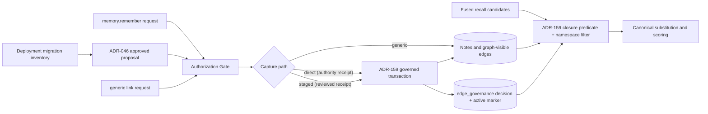
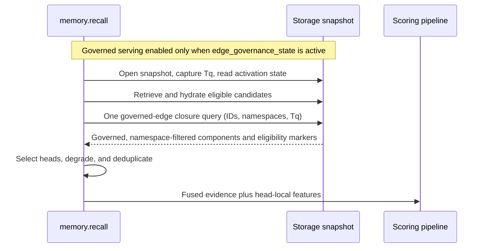

# ADR-157: Canonicalize Verified Supersession Chains Before Memory Recall Scoring

**Status**: proposed
**Date**: 2026-08-15
**Scope**: the `memory.recall` serving predicate for supersession chain-head
substitution, its degradation contract, its activation gate, and the bounded
`memory.remember` capture surface that feeds it. The governance mechanism —
which `supersedes` edges are authorized to substitute, how that authority is
stored, invalidated, migrated, and activated — is defined by
[ADR-159](ADR-159-edge-governance-provenance.md) and consumed here, not
redefined. The public recall wire shape remains unchanged, and the generic
graph edge contract is not narrowed.
**Supersedes (narrowly)**: ADR-013's default-retrieval rule that any incoming
`supersedes` edge makes a note non-current, only as that rule applies to
`memory.recall` after the migration-gated activation defined here. ADR-013
otherwise stands.

## Context

A production-derived labelled evaluation of `memory.recall` (42 real
directive-recall queries; 22 with a labelled correct answer in the store)
measured nDCG@10 0.673, with the correct answer in the top 10 for 20 of 22
answerable queries. Both complete misses shared one failure mechanism: the
stored correct answer was a correction note that intentionally replaced an
earlier note, the replacement was recorded only in note text rather than as a
`supersedes` edge, and the terse correction lost lexically to the older,
vocabulary-richer note it replaced. The remaining 20 of 42 queries had no
stored answer at all — a persistence gap outside retrieval's reach and
explicitly out of scope here.

Today the recall pipeline applies supersession only as binary suppression
after scoring. It gathers all ranked candidate IDs into one `EdgeFilter`,
pages that candidate-batched filter to exhaustion, unions the matched target
IDs with a `properties.supersedes` shortcut, and removes those IDs. This is
already a batched exclusion operation, not a per-candidate graph access
pattern. It cannot substitute a chain head that retrieval did not rank or
preserve a matched member's fused retrieval evidence for that head. A
previous attempt at additive temporal scoring was reverted because recency
terms outweighed semantic relevance on unrelated queries; any mechanism here
must not reintroduce that class.

That behavior implements [ADR-013](ADR-013-note-kind-taxonomy.md)
§"Supersession via edge, not field," which says default retrieval excludes a
note with any incoming `supersedes` edge. The current implementation is
directly visible in `crates/khive-pack-memory/src/handlers/recall.rs`: the
suppression stage pages all matching incoming edges, unions their targets
with `properties.supersedes` targets, and removes the union. This ADR
therefore changes serving semantics, not only future write semantics, and
requires an explicit compatibility transition.

An earlier revision of this ADR defined its own governance mechanism — a
runtime-reserved `metadata.created_by_actor` edge stamp with reserved-key
input validation. Analysis established five defect classes against that
mechanism (stamp survival across identity mutations, reviewer difference
mistaken for authority, pre-activation forgery, no in-place migration
primitive, no write fence). All five are discharged by ADR-159's design —
a caller-unreachable decision log, a preimage-bound serving projection with
database-layer invalidation triggers, an in-place classification primitive,
and a transactional cutover fence — and this revision consumes that
mechanism instead of carrying its own.

## Teardown

- **Two misses are too few for a change.** They are too few for a general
  ranking policy, but they are 2/22 — 9.1% — of queries with a stored correct
  answer, and both share one failure mechanism. That supports a narrow
  correctness mechanism, not a ranking program.
- **Write-time edges plus binary filtering are sufficient.** No. Write-time
  capture is prospective; filtering can remove obsolete candidates but cannot
  guarantee that a weaker successor enters the served set.
- **An edge alone enables chain-head replacement.** No. The edge must be
  governed per ADR-159, a chain member must be present in the pre-final
  candidates, every traversed edge and node must remain in that candidate's
  namespace, and the chain must have one live memory head created no later
  than the query start.
- **Correction-like text is trustworthy structure.** No. Negation,
  quotations, malformed IDs, and scope differences can fabricate graph truth.
  Text may support a curation proposal, never automatic edge creation.
- **Cluster recency safely approximates supersession.** No. Similarity does
  not establish replacement, and it cannot recover targets absent from the
  served pools.
- **A reranker feature is the smallest change.** Under ADR-033, feature
  reranking is optional and replaces default scoring when configured.
  Verified truth must not depend on an optional weight.
- **Corpus check.** The prior-decision search was inconclusive at authoring
  time; the acceptance check must confirm no conflicting accepted ADR was
  missed.

## Decision

Treat supersession as verified truth canonicalization, not as a general
ranking signal. Only **GOVERNED** `supersedes` edges participate in recall
chain-head substitution.

**GOVERNED is defined by ADR-159 and only by ADR-159**: an edge is governed
when it satisfies ADR-159's closure predicate in the recall query's read
snapshot — `edge_governance_state.status == 'active'`, the edge is live with
`relation == 'supersedes'`, `target_backend` IS NULL (governance is
local-only per ADR-159 §2), and live memory-note endpoints, an
`edge_governance_active` row exists with `edge_id` equal to the edge's ID,
and that row's bound namespace/source/target/relation/target_backend
match the edge's current preimage under null-safe (`IS`) comparison. Nothing in edge `metadata`, note `properties`, or any
other caller-writable surface confers or removes governance, and no
classification, degradation, suppression, or substitution in this ADR may
branch on an ungoverned edge.

Canonicalization begins with an edge set filtered to governed edges in the
candidate's write namespace. Cross-namespace and ungoverned edges are absent
from closure input, exactly as if they did not exist. It then follows only
live (non-deleted) memory nodes, selects only a live memory head, and
excludes every note or edge created after the recall query's start snapshot.

Adopt governed write-time capture, reviewed historical migration and
backfill (through ADR-159's classification primitive and the forthcoming
ADR-046 amendment), and one batched governed-edge chain-head substitution.
Keep the current recall behavior active until ADR-159's activation state is
`active`. Do not adopt cluster recency or reranker features from this
evidence.

### Component boundary

The Gate is the authorization seam and may apply stricter deployment policy.
The governed-transaction requirements (authority receipt, atomic decision +
marker insert) are ADR-159 §2's; the closure predicate is ADR-159 §4's. This
ADR owns what happens on either side of that seam: the capture surface
feeding it and the serving pipeline consuming it.

### 1. Capture supersession atomically

`memory.remember` may gain an optional, bounded
`supersedes: [<full-memory-uuid>, ...]` field.

Edges are directed `new --supersedes--> old`. Every target must be a live
(non-deleted) memory note in the caller's resolved write namespace, which is
also the new note's namespace. On this direct path, the write proceeds as an
ADR-159 owner-bounded governed transaction: the Gate/authority provider must
return an `AuthorityReceipt` for action `memory.supersede` over each target
and the bound endpoints, and the note insert, edge upsert, governance
decision, and active marker commit atomically. A target outside the caller's
namespace, a target the authority provider does not grant, or a failed
receipt is refused as `invalid_supersedes` with
`staged_path: "ADR-046 proposal lifecycle"` in the refusal payload; the note
and all declared edges commit atomically, and failed validation commits
neither. The write must not create a cycle.

How the authority provider decides ownership — and what it can honestly
decide given the measured absence of owner signal on the current memory
population — is ADR-159 §7's activation-mode question and the ADR-046
amendment's contract, not this ADR's. In single-principal mode the receipt
reduces to the deployment's single authority; in multi-actor mode it
requires a real endpoint-authority provider, and activation fails closed
without one.

Cross-actor and legacy-target supersession uses the existing ADR-046
proposal lifecycle. A change-set proposing the `supersedes` edge lands only
after approval satisfying the amended ADR-046 contract (endpoint-scoped
reviewer authority per ADR-159, not mere reviewer difference). At apply
time the reviewed path is an ADR-159 governed transaction: the decision
record names the reviewer as authorizer and the apply worker's identity only
as executor. This ADR does not duplicate or replace ADR-046's lifecycle
mechanics.

The write remains authorized at the existing ADR-018 Gate seam. Its
`GateRequest` carries the resolved caller actor, the resolved write
namespace, and the unchanged target IDs, so deployed policy can evaluate all
three. Gate policy may tighten access further, but it may not relax the
ADR-159 receipt floor. These checks do not create a new capability system
and are not storage authorization checks.

A `supersedes` edge created through generic `link` remains legal graph data
under the base endpoint contract — ADR-017 makes endpoint rules additive
only, so refusing it is unavailable by construction. It remains visible to
graph queries and traversal and may preserve historical meaning, but it has
no active marker and therefore no recall-canonicalization authority unless
it is later authorized through ADR-159's classification path. Recall
substitution is a view-layer privilege granted only to governed edges. A
contract test must prove that the composed ADR-002 base rules and loaded
ADR-017 `EDGE_RULES` accept memory-note-to-memory-note `supersedes`; no
handler-local bypass is permitted.

The request field is an edge-creation instruction, not an authority marker.
A governed supersedes edge can be retired from canonicalization through the
existing by-ID curation surface, `delete(id=<edge-uuid>)`, which remains
subject to the existing Gate: ADR-159's invalidation triggers clear the
active marker on deletion, and the next recall snapshot restores the prior
eligible head. This is the recovery path for an incorrect or malicious
governed supersession; no separate unsupersede verb is introduced. Deleting
an ungoverned edge changes graph history but cannot change recall
canonicalization.

Correction-text detection may emit diagnostics or proposals. It may not mint
edges or affect ordering.

### 2. Backfill through curation

An offline campaign may scan historical notes for supersession claims. Each
scan is bounded to live (non-deleted) notes of kind `memory` in one captured
namespace snapshot. Both the proposed source and target must be live memory
notes in that same namespace. The campaign produces dry-run proposals
containing the source note, resolved target, evidence span, resolution
method, and per-edge annotation.

Backfill reads and proposals use same-namespace evidence only. A legacy
property reference to a note in another namespace is reported as a
diagnostic; it does not produce a proposal or governed edge and, after
activation, never participates in serving suppression.

Full UUIDs may be proposed directly. Short IDs are eligible only when
uniquely resolved against the captured namespace snapshot. Ambiguous claims
remain observations. Only proposals approved under the amended ADR-046
contract create governed edges, through ADR-159's governed transaction for a
new edge or its `classify_existing_edge_governance` primitive for an
existing one — the latter preserving the edge's UUID, `created_at`, and
metadata byte-for-byte. A dry-run result, unapproved proposal, or legacy
property has no governed authority.

Complexity is `O(N × L + P)` offline, with no recall hot-path cost.

### 3. Migration and compatibility

#### Behavior delta

Before activation, the current `memory.recall` contract remains in force:
every matching incoming `supersedes` edge can suppress its target, and the
legacy `properties.supersedes` shortcut can do the same. After activation,
only governed edges can affect recall canonicalization; legacy properties
and ungoverned edges are inert to that serving decision.

This is the narrow supersession relation declared at the top of this ADR. It
supersedes only ADR-013 §"Supersession via edge, not field" lines 148-150's
default-retrieval rule as applied by `memory.recall`: the existence of an
arbitrary incoming edge no longer proves that a memory note is non-current.
ADR-013's edge direction, history preservation, chain-walk model, graph
visibility, endpoint contract, and all behavior outside this `memory.recall`
serving predicate remain in force.

#### Migration, fence, and cutover

Migration mechanics belong to ADR-159 §§5-6 and the ADR-046 amendment:
inventory of the legacy population (measured: 234 live memory-to-memory
`supersedes` edges), per-edge reviewed classification through the
preimage-guarded in-place primitive, a single-writer `BEGIN IMMEDIATE`
cutover fence that gives every late-arriving legacy edge a durable
disposition, and the `edge_governance_state` activation receipt. This ADR
adds one consumption rule on top:

**`memory.recall` reads `edge_governance_state.status` in the same snapshot
as the closure query. `active` enables the governed serving predicate below;
any other value — including a boot-time trigger-verification demotion per
ADR-159 §7 — keeps the pre-activation contract in force for that query.**
An incomplete or unreconciled migration is therefore a rollout-gate failure,
never a recall degradation: recall simply continues under the current
contract.

Rejected legacy edges remain graph-visible with their durable disposition
(ADR-159 §8); a later authorized review may reauthorize the unchanged
preimage. Nothing in this ADR mutates graph history to repair a view.

### 4. Canonicalize chains in one batch

When the activation state is `active` in the query snapshot — after fusion,
and before note-local scoring or optional reranking:

1. At query entry, open the consistent read snapshot used for candidate
   hydration and closure, and read the storage query-start timestamp `Tq`
   from that snapshot before candidate retrieval.
2. Collect at most `C ≤ 200` candidates that are live (non-deleted) notes of
   kind `memory`, belong to the recall visible set, and have
   `created_at ≤ Tq`. Retain each candidate's write namespace as part of the
   closure input.
3. In one database query against that snapshot, fetch the bounded
   supersession closure. Before traversal or classification, apply the three
   closure-input exclusion classes together: **cross-namespace**,
   **ineligible-node**, and **ungoverned**. An edge is cross-namespace when
   its namespace differs from the candidate namespace or either endpoint is
   outside that namespace. An edge is ungoverned when it fails ADR-159's
   closure predicate (no matching active marker, or a bound-preimage
   mismatch). The query starts from `edge_governance_active` rows via the
   covering index and joins `graph_edges` by unique ID, so ungoverned and
   cross-namespace edges are absent from the result set, exactly as if they
   did not exist; neither class may affect classification, degradation,
   suppression, or output. An edge incident to an ineligible node is
   excluded from traversal and head selection and may be returned only as
   the eligibility marker described in step 5.
4. Within that governed, namespace-filtered edge set, follow eligible
   incoming edges toward newer notes, with depth 16 and 800 expanded-node
   caps. Every traversed edge must be live, governed, and have
   `created_at ≤ Tq`; every traversed source, intermediate node, target, and
   selected head must be a live (non-deleted) note of kind `memory` with
   `created_at ≤ Tq`.
5. Map each valid component to its unique eligible head. Classify forks and
   unavailable heads only from the governed, namespace-filtered edge set. A
   same-namespace head reached by a governed edge that is deleted, is not a
   memory note, or was created after `Tq` is head-unavailable and is never
   emitted. A candidate whose only supersession evidence is cross-namespace
   or ungoverned remains a one-node component and is emitted normally as its
   own head.
6. Preserve the best fused retrieval evidence from matched members.
7. Take salience, decay, content, timestamps, and every other note-local
   scoring feature only from the eligible head selected from the query-start
   snapshot.
8. Deduplicate before scoring.

This is pointer substitution licensed by a governed explicit relation — not
a recency boost.

After activation, the governed, same-namespace closure is a
serving/view-layer predicate consistent with ADR-007's attribution-only
namespace model and the repository's data-vs-view principle. It restricts
what `memory.recall` may substitute; it does not reject or remove
cross-namespace or ungoverned graph data, make namespace an authorization
boundary, narrow the generic `link` endpoint contract, or change
namespace-agnostic by-ID operations. Generic-link `supersedes` edges remain
visible to graph queries and traversal and retain their historical meaning;
those that remain ungoverned carry no recall-canonicalization authority.
Multiple visible namespaces are canonicalized as independent components.
Before activation, the current edge/property suppression behavior remains
active exactly as required by §3.

After activation, graph work is one round trip and `O(C + E_b)`. One bounded
governed-edge closure query replaces the current candidate-batched,
paginated exclusion query; there may be no per-candidate fallback. The
legacy `properties.supersedes` shortcut does not license substitution after
activation. A curated legacy property must first become a governed edge
through the reviewed backfill path, which keeps edge deletion authoritative
for recovery.

### Serving sequence

### 5. Degradation contract

After activation, the existing recall audit payload gains additive
degradation modes; the public recall result shape remains unchanged. Each
mode has a named consumer and must not ship until that consumer recognizes
it. The table is evaluated only over governed, same-namespace edges after
node and `Tq` eligibility checks. Cross-namespace and ungoverned edges never
reach these conditions, emit no degradation mode, and cannot affect
suppression or output. An incomplete or unreconciled migration is a
rollout-gate failure, not a recall degradation: the activation state stays
non-`active` and recall continues under the pre-activation contract.
Write-path refusals belonging to ADR-159's governed transaction and the
amended ADR-046 contract (authority-receipt failures, preimage mismatches)
are specified there; this table covers the serving pipeline plus the one
capture-surface refusal this ADR defines.

| Condition                                                                                                                                                | Behavior                                                                                      | Mode                            | Required consumer                                       |
| -------------------------------------------------------------------------------------------------------------------------------------------------------- | --------------------------------------------------------------------------------------------- | ------------------------------- | ------------------------------------------------------- |
| Batch governed-edge closure query fails                                                                                                                  | Return baseline ranking without canonicalization; no per-candidate retry                      | `supersession_lookup_failed`    | `RecallExecuted` projection and frozen replay evaluator |
| Unique same-namespace head in the governed, namespace-filtered edge set is deleted, non-memory, or post-`Tq`                                             | Suppress known superseded members; fill from unaffected candidates                            | `supersession_head_unavailable` | `RecallExecuted` projection and frozen replay evaluator |
| Multiple eligible heads in the governed, namespace-filtered edge set                                                                                     | Inject no branch; suppress non-heads; independently retrieved eligible heads compete normally | `supersession_fork`             | `RecallExecuted` projection and frozen replay evaluator |
| Cycle or traversal cap in the governed, namespace-filtered edge set                                                                                      | Suppress the affected component                                                               | `supersession_chain_invalid`    | `RecallExecuted` projection and frozen replay evaluator |
| Invalid direct-path write: target outside the caller's write namespace, target not granted by the authority receipt, dead or non-memory target, or cycle | Commit neither note nor edges; return the ADR-046 staged-path pointer                         | `invalid_supersedes`            | `memory.remember` error mapper and Gate audit stream    |
| Ambiguous or ineligible backfill                                                                                                                         | Create no edge; retain the proposal record                                                    | `backfill_ambiguous`            | backfill proposal processor                             |

### 6. Activation gate

Replay the frozen evaluation pools with a frozen, curated edge overlay. Each
replay query must use its captured `Tq` and a consistent snapshot. The
evaluator may introduce a target only through deterministic substitution
from a captured candidate chain member and only when the edge is governed
per ADR-159's closure predicate and the edge, every intermediate node, and
the head satisfy the same-namespace, live-memory, and `created_at ≤ Tq`
predicates. It may not rerun retrieval, and its overlay may not grant
governance to an edge lacking an active marker.

**Ordering.** The replay gate runs after ADR-159's migration classification
is terminal for the inventoried population and before its fence transaction
commits `status = 'active'`. During the gate, the evaluator applies
ADR-159's closure predicate with the `edge_governance_state.status ==
'active'` conjunct treated as satisfied by the staged activation under
evaluation; every other conjunct — live edge, live memory endpoints,
active-marker row, bound-preimage equality — is evaluated against real
storage. This as-if-active reading is sound because the governance decisions
and active markers for the inventoried population exist before the fence per
ADR-159 §6's pre-fence steps, and any edge arriving after the inventory
receives its durable disposition inside the fence transaction itself and,
being created after the frozen pools were captured, could not satisfy any
replayed query's `Tq` predicate in any case. Only when the gate passes does
the fence commit `status = 'active'`; that single committed write is what
flips `memory.recall` to the governed serving predicate through §3's
consumption rule, so serving changes atomically with activation and never
before the gate has passed. In the requirement list below, the first item is
therefore discharged at fence commit time — the gate's pass is a
precondition of that commit, not the reverse.

Activation requires:

- ADR-159's activation preconditions satisfied and its
  `edge_governance_state` row `active` — schema/trigger identity verified,
  migration classification terminal for the inventoried population, fence
  committed (all per ADR-159 §6; not re-verified here, consumed as the
  activation receipt);
- the deployment's activation mode (single-principal or multi-actor per
  ADR-159 §7) recorded in the receipt and consistent with the deployed
  Gate/authority provider;
- both supersession hard misses become top-10 correct answers;
- no existing top-10 correct answer falls out across the 22 answerable
  queries;
- nDCG@10 remains at least 0.673;
- the 20 no-stored-answer cases remain classified as persistence failures;
- exactly one governed-edge closure query at `C = 200`, compared with the
  existing one batched exclusion query;
- recall p50 and p95 within a predeclared 5% non-inferiority margin;
- a direct-path refusal test proving that a target the authority provider
  does not grant refuses as `invalid_supersedes`, commits neither note nor
  edges, and returns the ADR-046 staged-path pointer;
- a staged-path acceptance test proving that a proposal carrying
  `supersedes` edges lands under the amended ADR-046 contract and produces a
  governed edge (decision + active marker) at apply time;
- a cross-namespace-inertness test proving that adding a hostile
  cross-namespace edge produces byte-identical recall output to the same
  snapshot without that edge;
- a generic-link inertness test proving that adding a same-namespace
  memory-to-memory `supersedes` edge through generic `link` changes nothing
  in recall output, byte-identical to the same snapshot without that edge;
- an invalidation-consumption test proving that after an endpoint rewrite,
  merge rewire, soft delete, or same-key resurrection clears an edge's
  active marker (ADR-159 §3), the next recall snapshot no longer substitutes
  through that edge and restores the prior eligible head;
- a demotion test proving that when `edge_governance_state` is demoted to
  `inactive` (including by ADR-159 §7's boot-time trigger verification),
  recall serves the pre-activation contract with no partial governed
  behavior;
- test coverage of chains, duplicate mappings, forks, cycles,
  deleted/non-memory/post-`Tq` same-namespace heads, unavailable heads,
  ungoverned-edge inertness, edge-delete recovery, closure-query failure,
  atomic rollback, and a write rejected by the Gate;
- an endpoint-contract test through `validate_edge_relation_endpoints` with
  the memory pack loaded, proving a newly created generic memory-to-memory
  `supersedes` edge remains legal but ungoverned; and
- a consumer test for every degradation mode named above.

If both misses are not recovered, do not enable substitution. Record the
result as candidate-generation or persistence evidence; do not compensate
with cluster recency.

## Ceiling analysis

Baseline: nDCG@10 0.673, correct answer in top-10 for 20/22, at rank 1 for
7/22.

A mechanism affecting only the two misses can improve mean nDCG by at most
`2/22 = 0.091`, giving a loose ceiling of 0.764. Its top-10 ceiling is 22/22
and, if only those two reach rank 1, its top-1 ceiling is 9/22.

| Option                                             | Recovery ceiling on the frozen set                                                             | Complexity                                                                 | Outcome                                 |
| -------------------------------------------------- | ---------------------------------------------------------------------------------------------- | -------------------------------------------------------------------------- | --------------------------------------- |
| Governed write-time linking                        | 0/2 historical misses                                                                          | `O(S)`, `S ≤ 16`; existing batched suppression remains                     | Adopt explicit input only               |
| Governed-edge chain resolution                     | 0/2 without governed edges or a candidate chain member; conditionally 2/2                      | One `O(C + E_b)` closure query replaces one exclusion query                | Adopt with linking + backfill and proof |
| Cluster recency                                    | 0/2 hard misses; could at most move 13 reachable non-top-1 targets                             | `O(C²d)` pairwise                                                          | Reject                                  |
| Reranker feature                                   | 0/2 if scoring existing candidates; head injection is chain resolution                         | `O(C)` after batched metadata                                              | Reject                                  |
| Backfill alone                                     | Guaranteed 0/2 on frozen served pools; theoretical ≤2/2 only from a wider hidden candidate set | Offline `O(NL + P)`                                                        | Necessary but insufficient              |
| Governed linking + migration/backfill + resolution | Conditional 2/2; nDCG ≤ 0.764, top-10 ≤ 22/22                                                  | Reviewed offline migration plus bounded write and one recall closure query | Chosen, migration- and activation-gated |

## Alternatives considered

- **Define the governance mechanism inside this ADR:** rejected. The first
  revision did, via runtime-reserved metadata keys, and five defect classes
  killed that mechanism (see Context). Governance storage, stamping,
  invalidation, migration, and activation are ADR-159's contract; this ADR
  consumes its closure predicate and activation state.
- **Reject memory-to-memory `supersedes` on generic `link`:** unavailable
  because it would tighten ADR-002's base endpoint contract, while ADR-017
  permits pack endpoint rules to add legal pairs only. Preserve the graph
  edge and withhold view-layer authority instead.
- **Governed linking + backfill + current binary filter:** cheapest
  fallback, but cannot guarantee successor promotion and remains
  suppression-only.
- **Cluster-scoped multiplicative recency:** might improve reachable
  ordering, but cannot recover absent targets and confuses similarity with
  authority.
- **ADR-033 chain-position feature:** optional weighting is the wrong
  contract for semantic truth.
- **Automatic text-derived edges:** fastest coverage, unacceptable
  fabrication risk.
- **No build:** appropriate if the offline gate fails. The aggregate
  evidence does not support a broad ranking project, but two
  mechanism-identical hard misses justify the bounded experiment.

## Rationale

Supersession differs from freshness. Freshness says a note is newer;
supersession says it intentionally replaces another. Only a governed
instance of the latter licenses recall substitution.

Governed direct capture prevents new unlinked chains, reviewed migration and
backfill repair historical structure without silently revoking existing
serving authority, and batched governed-edge chain resolution prevents a
lexically rich obsolete note from eclipsing its terse successor. The closure
retains the current batched graph-access shape while upgrading the operation
from exclusion to bounded canonical substitution.

Splitting the mechanism out is itself load-bearing: governance authority
lives in caller-unreachable storage with database-layer invalidation
(ADR-159), so this ADR's serving predicate can be a pure consumer — one
indexed join against the active projection — with no defense logic of its
own to get wrong. The governed, namespace-filtered closure prevents stored
cross-namespace or ungoverned data from influencing serving after the
migration-gated cutover while leaving generic supersession edges available
as historical graph data.

This remains a data-integrity intervention with a serving canonicalizer —
not a general ranking program.

## Implementation fences

### MAY

- Add bounded, optional, atomic supersession capture to `memory.remember`,
  routed through ADR-159's owner-bounded governed transaction.
- Inventory and classify pre-existing supersession edges and properties
  through ADR-159's migration path before cutover.
- Use text detection for warnings, observations, or proposals.
- Replace the candidate-batched binary edge/property suppression with one
  bounded batch governed-edge closure.
- Add non-breaking internal audit and diagnostic fields.

### MAY NOT

- Change the public `memory.recall` request or normal response shape.
- Add global additive recency, unscoped recency multipliers, or cluster
  recency.
- Create edges from text alone.
- Query the graph per candidate, including during degradation.
- Make verified supersession depend on reranker configuration.
- Define, read, or trust any governance evidence outside ADR-159's closure
  predicate — in particular, treat any edge `metadata` or note `properties`
  value as conferring or removing recall authority.
- Admit an edge to closure input unless it is governed per ADR-159 and its
  namespace and both endpoint namespaces equal the root candidate's
  namespace, or let a cross-namespace or ungoverned edge affect
  classification, degradation, suppression, or output.
- Traverse an ineligible node, emit a deleted or non-memory head, or credit
  a note or edge created after `Tq`.
- Treat the governed, same-namespace serving predicate as storage isolation,
  authorization, endpoint-contract tightening, or a restriction on by-ID
  operations.
- Reject a generic memory-to-memory `supersedes` edge solely because it is
  ungoverned, hide it from graph queries or traversal, or grant it
  recall-canonicalization authority.
- Enable the governed serving predicate while `edge_governance_state` is not
  `active`, or keep any governed behavior partially enabled after a
  demotion.
- Claim improvement for the 20 no-stored-answer queries.

### Verify by

- Frozen evaluation replay under the activation gate above.
- Query-count instrumentation at `C = 1, 10, 100, 200`.
- Latency comparison against the existing candidate-batched exclusion
  operation.
- Determinism, direct-path refusal, staged-path acceptance, cross-namespace
  and generic-link byte-identical inertness, invalidation-consumption,
  demotion, live-memory, query-snapshot, edge-delete recovery, and
  degradation-consumer tests.
- Central endpoint-rule legality verification before dependent
  implementation merges, proving the generic edge remains legal while
  serving ignores it unless governed.
