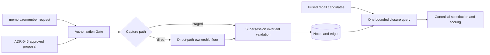
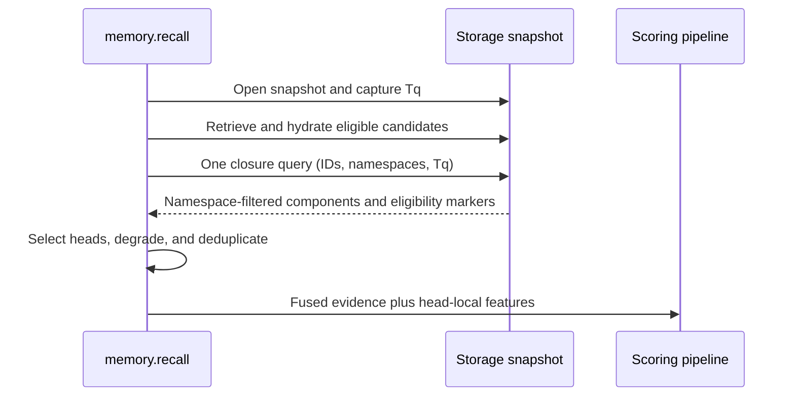

# ADR-157: Canonicalize Verified Supersession Chains Before Memory Recall Scoring

**Status**: proposed
**Date**: 2026-08-15
**Scope**: ownership-bounded `memory.remember` supersession capture, ADR-046 staged capture,
offline edge backfill, and the internal `memory.recall` pipeline. The public recall contract
remains unchanged.

## Context

A production-derived labelled evaluation of `memory.recall` (42 real directive-recall
queries; 22 with a labelled correct answer in the store) measured nDCG@10 0.673, with the
correct answer in the top 10 for 20 of 22 answerable queries. Both complete misses shared
one failure mechanism: the stored correct answer was a correction note that intentionally
replaced an earlier note, the replacement was recorded only in note text rather than as a
`supersedes` edge, and the terse correction lost lexically to the older, vocabulary-richer
note it replaced. The remaining 20 of 42 queries had no stored answer at all — a
persistence gap outside retrieval's reach and explicitly out of scope here.

Today the recall pipeline applies supersession only as binary suppression after scoring.
It gathers all ranked candidate IDs into one `EdgeFilter`, pages that candidate-batched
filter to exhaustion, unions the matched target IDs with a `properties.supersedes`
shortcut, and removes those IDs. This is already a batched exclusion operation, not a
per-candidate graph access pattern. It cannot substitute a chain head that retrieval did
not rank or preserve a matched member's fused retrieval evidence for that head. A previous
attempt at additive temporal scoring was reverted because recency terms outweighed
semantic relevance on unrelated queries; any mechanism here must not reintroduce that
class.

## Teardown

- **Two misses are too few for a change.** They are too few for a general ranking policy,
  but they are 2/22 — 9.1% — of queries with a stored correct answer, and both share one
  failure mechanism. That supports a narrow correctness mechanism, not a ranking program.
- **Write-time edges plus binary filtering are sufficient.** No. Write-time capture is
  prospective; filtering can remove obsolete candidates but cannot guarantee that a weaker
  successor enters the served set.
- **An edge alone enables chain-head replacement.** No. A chain member must be present in
  the pre-final candidates, every traversed edge and node must remain in that candidate's
  namespace, and the chain must have one live memory head created no later than the query
  start.
- **Correction-like text is trustworthy structure.** No. Negation, quotations, malformed
  IDs, and scope differences can fabricate graph truth. Text may support a curation
  proposal, never automatic edge creation.
- **Cluster recency safely approximates supersession.** No. Similarity does not establish
  replacement, and it cannot recover targets absent from the served pools.
- **A reranker feature is the smallest change.** Under ADR-033, feature reranking is
  optional and replaces default scoring when configured. Verified truth must not depend on
  an optional weight.
- **Corpus check.** The prior-decision search was inconclusive at authoring time; the
  acceptance check must confirm no conflicting accepted ADR was missed.

## Decision

Treat supersession as verified truth canonicalization, not as a general ranking signal.
Canonicalization begins with an edge set filtered to the candidate's write namespace:
an edge is absent from closure input unless the edge and both endpoints carry that
namespace. It then follows only live (non-deleted) memory nodes, selects only a live memory
head, and excludes every note or edge created after the recall query's start snapshot.

Adopt explicit write-time capture, curated historical backfill, and one batched
serve-time chain-head substitution. Do not adopt cluster recency or reranker features from
this evidence.

### Component boundary

The Gate is the authorization seam and may apply stricter deployment policy. The
direct-path ownership check is the minimum prevention rule guaranteed by this ADR, not a
Gate policy. The write validator enforces data-integrity invariants, while the closure
query applies serving predicates without changing stored records.

### 1. Capture supersession atomically

`memory.remember` may gain an optional, bounded `supersedes: [<full-memory-uuid>, ...]`
field.

Edges are directed `new --supersedes--> old`. Every target must be a live (non-deleted)
memory note in the caller's resolved write namespace, which is also the new note's
namespace. On this direct path, every target must also carry durable
`metadata.created_by_actor` exactly equal to the caller's resolved actor identity. A target
outside that namespace, a target attributed to another actor, or a target without that
metadata is refused as `invalid_supersedes`; namespace visibility alone is not sufficient.
The refusal payload includes `staged_path: "ADR-046 proposal lifecycle"`. The write must
not create a cycle. The note and all declared edges commit atomically; failed validation
or edge creation commits neither.

Cross-actor and legacy-target supersession uses the existing ADR-046 proposal lifecycle.
A change-set proposing the `supersedes` edge lands only after approval by an actor other
than the proposer. That staged path supplies mandatory review; this ADR does not duplicate
or replace ADR-046's lifecycle mechanics. Legacy rows without durable ownership metadata
are never backfilled with guessed ownership.

The write remains authorized at the existing ADR-018 Gate seam. Its `GateRequest` carries
the resolved caller actor, the resolved write namespace, and the unchanged target IDs in
the request arguments, so deployed policy can evaluate all three. After the Gate allows
dispatch, the handler enforces the ownership floor plus the same-namespace, liveness,
memory-kind, and cycle invariants. Gate policy may tighten access further, but it may not
relax this ADR-level floor. These checks do not create a new capability system and are not
storage authorization checks.

Every note created by `memory.remember` carries durable
`metadata.created_by_actor = {"kind": <kind>, "id": <id>}` attribution copied from the
resolved caller identity. Each directly created edge carries the same attribution shape
and the write namespace. Edge creation must continue through the centralized endpoint
validator. Before implementation is enabled, a contract test must prove that the composed
ADR-002 base rules and loaded ADR-017 `EDGE_RULES` accept memory-note-to-memory-note
`supersedes`; no handler-local bypass is permitted. This forward-only attribution rule
requires no migration and does not infer authorship for legacy notes.

The request field is an edge-creation instruction, not a second authority marker in note
properties. A supersedes edge can be removed through the existing by-ID curation surface,
`delete(id=<edge-uuid>)`, which remains subject to the existing Gate. The next recall
snapshot then excludes that edge and restores the prior eligible head. This is the recovery
path for an incorrect or malicious supersession; no separate unsupersede verb is
introduced.

Correction-text detection may emit diagnostics or proposals. It may not mint edges or
affect ordering.

### 2. Backfill through curation

An offline campaign may scan historical notes for supersession claims. Each scan is
bounded to live (non-deleted) notes of kind `memory` in one captured namespace snapshot.
Both the proposed source and target must be live memory notes in that same namespace. The
campaign produces dry-run proposals containing the source note, resolved target, evidence
span, resolution method, and per-edge annotation.

Backfill reads and proposals use same-namespace evidence only. A legacy property reference
to a note in another namespace is reported as a diagnostic; it does not produce a proposal
or edge and never participates in serving suppression.

Full UUIDs may be proposed directly. Short IDs are eligible only when uniquely resolved
against the captured namespace snapshot. Ambiguous claims remain observations. Only
ADR-046 proposals approved by an actor other than the proposer create edges. Approved
writes traverse the same Gate and atomic data-integrity validation as explicit capture;
the direct-path target-ownership check does not apply because the different-actor approval
is the staged authorization for legacy or cross-actor targets.

Complexity is `O(N × L + P)` offline, with no recall hot-path cost.

### 3. Canonicalize chains in one batch

After fusion and before note-local scoring or optional reranking:

1. At query entry, open the consistent read snapshot used for candidate hydration and
   closure, and read the storage query-start timestamp `Tq` from that snapshot before
   candidate retrieval.
2. Collect at most `C ≤ 200` candidates that are live (non-deleted) notes of kind `memory`,
   belong to the recall visible set, and have `created_at ≤ Tq`. Retain each candidate's
   write namespace as part of the closure input.
3. In one database query against that snapshot, fetch the bounded supersession closure.
   Before traversal or classification, exclude every edge whose edge namespace differs
   from the candidate namespace or whose source and target are not both in that namespace.
   The query predicates do not return such an edge, exactly as if it did not exist.
4. Within that namespace-filtered edge set, follow eligible incoming edges toward newer
   notes, with depth 16 and 800 expanded-node caps. Every traversed edge must be live with
   `created_at ≤ Tq`; every traversed source, intermediate node, target, and selected head
   must be a live (non-deleted) note of kind `memory` with `created_at ≤ Tq`. The query may
   return a same-namespace edge incident to an ineligible node only as an eligibility
   marker for step 5; that node is never traversed or emitted.
5. Map each valid component to its unique eligible head. Classify forks and unavailable
   heads only from the namespace-filtered edge set. A same-namespace head that is deleted,
   is not a memory note, or was created after `Tq` is head-unavailable and is never emitted.
   A candidate whose only supersession evidence is cross-namespace remains a one-node
   component and is emitted normally as its own head.
6. Preserve the best fused retrieval evidence from matched members.
7. Take salience, decay, content, timestamps, and every other note-local scoring feature
   only from the eligible head selected from the query-start snapshot.
8. Deduplicate before scoring.

This is pointer substitution licensed by an explicit relation — not a recency boost.

The same-namespace closure is a serving/view-layer predicate consistent with ADR-007's
attribution-only namespace model. It restricts what `memory.recall` may substitute; it
does not reject or remove cross-namespace graph data, make namespace an authorization
boundary, or change namespace-agnostic by-ID operations. Serving never classifies,
degrades, suppresses, or otherwise branches on a cross-namespace edge because that edge is
absent from closure input. Multiple visible namespaces are canonicalized as independent
components.

Graph work is one round trip and `O(C + E_b)`. One bounded closure query replaces the
current candidate-batched, paginated exclusion query; there may be no per-candidate
fallback. The legacy `properties.supersedes` shortcut does not license substitution after
activation. A curated legacy property must first become an attributed edge through the
backfill path, which keeps edge deletion authoritative for recovery.

### Serving sequence

### 4. Degradation contract

The existing recall audit payload gains additive degradation modes; the public recall
result shape remains unchanged. Each mode has a named consumer and must not ship until
that consumer recognizes it.

| Condition                                                                                                                                      | Behavior                                                                                      | Mode                            | Required consumer                                       |
| ---------------------------------------------------------------------------------------------------------------------------------------------- | --------------------------------------------------------------------------------------------- | ------------------------------- | ------------------------------------------------------- |
| Batch closure query fails                                                                                                                      | Return baseline ranking without canonicalization; no per-candidate retry                      | `supersession_lookup_failed`    | `RecallExecuted` projection and frozen replay evaluator |
| Unique same-namespace head in the namespace-filtered edge set is deleted, non-memory, or post-`Tq`                                             | Suppress known superseded members; fill from unaffected candidates                            | `supersession_head_unavailable` | `RecallExecuted` projection and frozen replay evaluator |
| Multiple eligible heads in the namespace-filtered edge set                                                                                     | Inject no branch; suppress non-heads; independently retrieved eligible heads compete normally | `supersession_fork`             | `RecallExecuted` projection and frozen replay evaluator |
| Cycle or traversal cap in the namespace-filtered edge set                                                                                      | Suppress the affected component                                                               | `supersession_chain_invalid`    | `RecallExecuted` projection and frozen replay evaluator |
| Invalid explicit write, including a target outside the caller's write namespace, foreign-authored target, or target without ownership metadata | Commit neither note nor edges; return the ADR-046 staged-path pointer                         | `invalid_supersedes`            | `memory.remember` error mapper and Gate audit stream    |
| Ambiguous or ineligible backfill                                                                                                               | Create no edge; retain the proposal record                                                    | `backfill_ambiguous`            | backfill proposal processor                             |

### 5. Activation gate

Replay the frozen evaluation pools with a frozen, curated edge overlay. Each replay query
must use its captured `Tq` and a consistent snapshot. The evaluator may introduce a target
only through deterministic substitution from a captured candidate chain member and only
when the edge, every intermediate node, and the head satisfy the same-namespace,
live-memory, and `created_at ≤ Tq` predicates. It may not rerun retrieval.

Activation requires:

- both supersession hard misses become top-10 correct answers;
- no existing top-10 correct answer falls out across the 22 answerable queries;
- nDCG@10 remains at least 0.673;
- the 20 no-stored-answer cases remain classified as persistence failures;
- exactly one closure query at `C = 200`, compared with the existing one batched exclusion
  query;
- recall p50 and p95 within a predeclared 5% non-inferiority margin;
- an ownership-refusal test proving that both a foreign-actor target and a legacy target
  without `created_by_actor` refuse the direct path as `invalid_supersedes`, commit neither
  note nor edges, and return the ADR-046 staged-path pointer;
- a staged-path acceptance test proving that an ADR-046 proposal carrying `supersedes`
  edges lands after approval by an actor different from the proposer;
- a cross-namespace-inertness test proving that adding a hostile cross-namespace edge
  produces byte-identical recall output to the same snapshot without that edge;
- test coverage of chains, duplicate mappings, forks, cycles, deleted/non-memory/post-`Tq`
  same-namespace heads, unavailable heads, edge-delete recovery, closure-query failure,
  atomic rollback, and a write rejected by the Gate;
- an endpoint-contract test through `validate_edge_relation_endpoints` with the memory pack
  loaded; and
- a consumer test for every degradation mode named above.

If both misses are not recovered, do not enable substitution. Record the result as
candidate-generation or persistence evidence; do not compensate with cluster recency.

## Ceiling analysis

Baseline: nDCG@10 0.673, correct answer in top-10 for 20/22, at rank 1 for 7/22.

A mechanism affecting only the two misses can improve mean nDCG by at most `2/22 = 0.091`,
giving a loose ceiling of 0.764. Its top-10 ceiling is 22/22 and, if only those two reach
rank 1, its top-1 ceiling is 9/22.

| Option                                | Recovery ceiling on the frozen set                                                             | Complexity                                                  | Verdict                                 |
| ------------------------------------- | ---------------------------------------------------------------------------------------------- | ----------------------------------------------------------- | --------------------------------------- |
| Write-time linking                    | 0/2 historical misses                                                                          | `O(S)`, `S ≤ 16`; existing batched suppression remains      | Adopt explicit input only               |
| Chain resolution                      | 0/2 without edges or a candidate chain member; conditionally 2/2                               | One `O(C + E_b)` closure query replaces one exclusion query | Adopt with linking + backfill and proof |
| Cluster recency                       | 0/2 hard misses; could at most move 13 reachable non-top-1 targets                             | `O(C²d)` pairwise                                           | Reject                                  |
| Reranker feature                      | 0/2 if scoring existing candidates; head injection is chain resolution                         | `O(C)` after batched metadata                               | Reject                                  |
| Backfill alone                        | Guaranteed 0/2 on frozen served pools; theoretical ≤2/2 only from a wider hidden candidate set | Offline `O(NL + P)`                                         | Necessary but insufficient              |
| Linking + backfill + chain resolution | Conditional 2/2; nDCG ≤ 0.764, top-10 ≤ 22/22                                                  | Bounded write plus one recall closure query                 | Chosen, activation-gated                |

## Alternatives considered

- **Linking + backfill + current binary filter:** cheapest fallback, but cannot guarantee
  successor promotion and remains suppression-only.
- **Cluster-scoped multiplicative recency:** might improve reachable ordering, but cannot
  recover absent targets and confuses similarity with authority.
- **ADR-033 chain-position feature:** optional weighting is the wrong contract for
  semantic truth.
- **Automatic text-derived edges:** fastest coverage, unacceptable fabrication risk.
- **No build:** appropriate if the offline gate fails. The aggregate evidence does not
  support a broad ranking project, but two mechanism-identical hard misses justify the
  bounded experiment.

## Rationale

Supersession differs from freshness. Freshness says a note is newer; supersession says it
intentionally replaces another. Only the latter licenses substitution.

Explicit linking prevents new unlinked chains, curated backfill repairs historical
structure, and batched chain resolution prevents a lexically rich obsolete note from
eclipsing its terse successor. The closure retains the current batched graph-access shape
while upgrading the operation from exclusion to bounded canonical substitution.

Ownership bounds the direct path to corrections of the caller's own attributed notes.
ADR-046 supplies different-actor approval when ownership is absent or belongs to another
actor, while namespace-filtered closure prevents stored cross-namespace data from
influencing serving.

This remains a data-integrity intervention with a serving canonicalizer — not a general
ranking program.

## Implementation fences

### MAY

- Add bounded, optional, atomic supersession capture to `memory.remember`.
- Use text detection for warnings, observations, or proposals.
- Replace the candidate-batched binary edge/property suppression with one bounded batch
  closure.
- Add non-breaking internal audit and diagnostic fields.

### MAY NOT

- Change the public `memory.recall` request or normal response shape.
- Add global additive recency, unscoped recency multipliers, or cluster recency.
- Create edges from text alone.
- Query the graph per candidate, including during degradation.
- Make verified supersession depend on reranker configuration.
- Admit an edge to closure input unless its namespace and both endpoint namespaces equal
  the root candidate's namespace, or let a cross-namespace edge affect classification,
  degradation, suppression, or output.
- Traverse an ineligible node, emit a deleted or non-memory head, or credit a note or edge
  created after `Tq`.
- Treat the same-namespace serving predicate as storage isolation, authorization, or a
  restriction on by-ID operations.
- Permit direct supersession of a target whose durable creator identity is absent or does
  not equal the caller's resolved identity; those targets require the ADR-046 staged path.
- Backfill legacy ownership metadata by inference or guesswork.
- Claim improvement for the 20 no-stored-answer queries.

### Verify by

- Frozen evaluation replay under the activation gate above.
- Query-count instrumentation at `C = 1, 10, 100, 200`.
- Latency comparison against the existing candidate-batched exclusion operation.
- Determinism, direct-path ownership refusal, different-actor staged approval,
  cross-namespace byte-identical inertness, live-memory, query-snapshot, edge-delete
  recovery, and degradation-consumer tests.
- Central endpoint-rule legality verification before dependent implementation merges.
